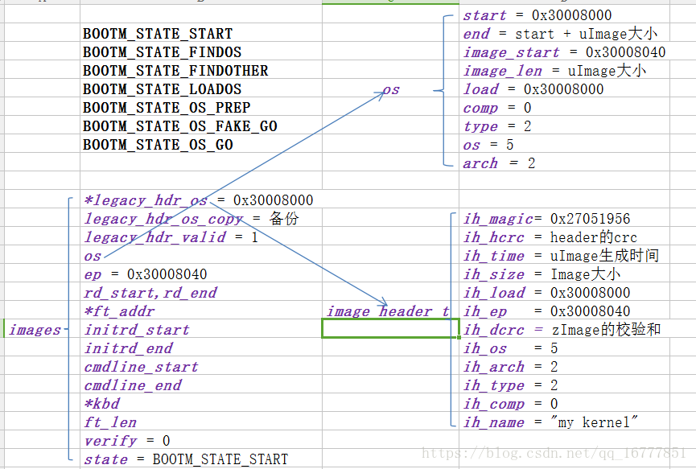

uboot解析uImage的kernel信息
============================

kernel信息的存放位置
---------------------

kernel信息主要包括两方面内容:

- kernel的镜像信息(包括其加载地址)：放在bootm_headers_t images->image_info_t os中
- kernel的入口地址:放在bootm_headers_t images->ulong ep中

详细可以参考 ``include/image.h`` 

::

    typedef struct bootm_headers {
        /*
         * Legacy os image header, if it is a multi component image
         * then boot_get_ramdisk() and get_fdt() will attempt to get
         * data from second and third component accordingly.
         */
        image_header_t	*legacy_hdr_os;		/* image header pointer */
        image_header_t	legacy_hdr_os_copy;	/* header copy */
        ulong		legacy_hdr_valid;

    #if IMAGE_ENABLE_FIT
        const char	*fit_uname_cfg;	/* configuration node unit name */

        void		*fit_hdr_os;	/* os FIT image header */
        const char	*fit_uname_os;	/* os subimage node unit name */
        int		fit_noffset_os;	/* os subimage node offset */

        void		*fit_hdr_rd;	/* init ramdisk FIT image header */
        const char	*fit_uname_rd;	/* init ramdisk subimage node unit name */
        int		fit_noffset_rd;	/* init ramdisk subimage node offset */

        void		*fit_hdr_fdt;	/* FDT blob FIT image header */
        const char	*fit_uname_fdt;	/* FDT blob subimage node unit name */
        int		fit_noffset_fdt;/* FDT blob subimage node offset */

        void		*fit_hdr_setup;	/* x86 setup FIT image header */
        const char	*fit_uname_setup; /* x86 setup subimage node name */
        int		fit_noffset_setup;/* x86 setup subimage node offset */
    #endif

    #ifndef USE_HOSTCC
        image_info_t	os;		/* os image info */
        ulong		ep;		/* entry point of OS */

        ulong		rd_start, rd_end;/* ramdisk start/end */

        char		*ft_addr;	/* flat dev tree address */
        ulong		ft_len;		/* length of flat device tree */

        ulong		initrd_start;
        ulong		initrd_end;
        ulong		cmdline_start;
        ulong		cmdline_end;
        bd_t		*kbd;
    #endif

        int		verify;		/* env_get("verify")[0] != 'n' */

    #define	BOOTM_STATE_START	(0x00000001)
    #define	BOOTM_STATE_FINDOS	(0x00000002)
    #define	BOOTM_STATE_FINDOTHER	(0x00000004)
    #define	BOOTM_STATE_LOADOS	(0x00000008)
    #define	BOOTM_STATE_RAMDISK	(0x00000010)
    #define	BOOTM_STATE_FDT		(0x00000020)
    #define	BOOTM_STATE_OS_CMDLINE	(0x00000040)
    #define	BOOTM_STATE_OS_BD_T	(0x00000080)
    #define	BOOTM_STATE_OS_PREP	(0x00000100)
    #define	BOOTM_STATE_OS_FAKE_GO	(0x00000200)	/* 'Almost' run the OS */
    #define	BOOTM_STATE_OS_GO	(0x00000400)
        int		state;

    #ifdef CONFIG_LMB
        struct lmb	lmb;		/* for memory mgmt */
    #endif
    } bootm_headers_t;

    extern bootm_headers_t images;

image_info_t的详细解释如下

::

    typedef struct image_info {
        ulong		start, end;		/* start/end of blob */     //包括附加节点信息之内的整个kernel节点的起始地址和结束地址
        ulong		image_start, image_len; /* start of image within blob, len of image */      //kernel镜像的起始地址，镜像长度
        ulong		load;			/* load addr for the image */       //镜像的加载地址
        uint8_t		comp, type, os;		/* compression, type of image, os type */       //镜像的压缩格式，镜像类型，操作系统类型
        uint8_t		arch;			/* CPU architecture */      //CPU体系结构
    } image_info_t;

- image_header数据结构如下

::

    /*
     * Legacy format image header,
     * all data in network byte order (aka natural aka bigendian).
     */
    typedef struct image_header {
        __be32		ih_magic;	/* Image Header Magic Number	*/
        __be32		ih_hcrc;	/* Image Header CRC Checksum	*/
        __be32		ih_time;	/* Image Creation Timestamp	*/
        __be32		ih_size;	/* Image Data Size		*/
        __be32		ih_load;	/* Data	 Load  Address		*/
        __be32		ih_ep;		/* Entry Point Address		*/
        __be32		ih_dcrc;	/* Image Data CRC Checksum	*/
        uint8_t		ih_os;		/* Operating System		*/
        uint8_t		ih_arch;	/* CPU architecture		*/
        uint8_t		ih_type;	/* Image Type			*/
        uint8_t		ih_comp;	/* Compression Type		*/
        uint8_t		ih_name[IH_NMLEN];	/* Image Name		*/
    } image_header_t;

解析uImage的时候主要目的就是填充image_info_t os和ulong ep

解析完成之后的示例如下

legacy-uImage中kernel信息的解析代码流程
----------------------------------------

从bootm_find_os入口开始说明，代码位于 ``common/bootm.c`` 中

::

    static int bootm_find_os(cmd_tbl_t *cmdtp, int flag, int argc,
                 char * const argv[])
    {
        //uImage地址对应传进来的参数argv[0]
        const void *os_hdr;
        bool ep_found = false;
        int ret;

        /* get kernel image header, start address and length */
        os_hdr = boot_get_kernel(cmdtp, flag, argc, argv,
                &images, &images.os.image_start, &images.os.image_len);
        //在boot_get_kernel中会设置images.os.image_start和images.os.image_len值
        if (images.os.image_len == 0) {
            puts("ERROR: can't get kernel image!\n");
            return 1;
        }

        /* get image parameters */
        switch (genimg_get_format(os_hdr)) {
    #if defined(CONFIG_IMAGE_FORMAT_LEGACY)
        case IMAGE_FORMAT_LEGACY:
            images.os.type = image_get_type(os_hdr);        //从头部中获取各参数值
            images.os.comp = image_get_comp(os_hdr);
            images.os.os = image_get_os(os_hdr);

            images.os.end = image_get_image_end(os_hdr);
            images.os.load = image_get_load(os_hdr);
            images.os.arch = image_get_arch(os_hdr);
            break;
    #endif
    #if IMAGE_ENABLE_FIT
        case IMAGE_FORMAT_FIT:
            if (fit_image_get_type(images.fit_hdr_os,
                           images.fit_noffset_os,
                           &images.os.type)) {
                puts("Can't get image type!\n");
                bootstage_error(BOOTSTAGE_ID_FIT_TYPE);
                return 1;
            }

            if (fit_image_get_comp(images.fit_hdr_os,
                           images.fit_noffset_os,
                           &images.os.comp)) {
                puts("Can't get image compression!\n");
                bootstage_error(BOOTSTAGE_ID_FIT_COMPRESSION);
                return 1;
            }

            if (fit_image_get_os(images.fit_hdr_os, images.fit_noffset_os,
                         &images.os.os)) {
                puts("Can't get image OS!\n");
                bootstage_error(BOOTSTAGE_ID_FIT_OS);
                return 1;
            }

            if (fit_image_get_arch(images.fit_hdr_os,
                           images.fit_noffset_os,
                           &images.os.arch)) {
                puts("Can't get image ARCH!\n");
                return 1;
            }

            images.os.end = fit_get_end(images.fit_hdr_os);

            if (fit_image_get_load(images.fit_hdr_os, images.fit_noffset_os,
                           &images.os.load)) {
                puts("Can't get image load address!\n");
                bootstage_error(BOOTSTAGE_ID_FIT_LOADADDR);
                return 1;
            }
            break;
    #endif
    #ifdef CONFIG_ANDROID_BOOT_IMAGE
        case IMAGE_FORMAT_ANDROID:
            images.os.type = IH_TYPE_KERNEL;
            images.os.comp = IH_COMP_GZIP;
            images.os.os = IH_OS_LINUX;

            images.os.end = android_image_get_end(os_hdr);
            images.os.load = android_image_get_kload(os_hdr);
            images.ep = images.os.load;
            ep_found = true;
            break;
    #endif
        default:
            puts("ERROR: unknown image format type!\n");
            return 1;
        }

        /* If we have a valid setup.bin, we will use that for entry (x86) */
        if (images.os.arch == IH_ARCH_I386 ||
            images.os.arch == IH_ARCH_X86_64) {
            ulong len;

            ret = boot_get_setup(&images, IH_ARCH_I386, &images.ep, &len);
            if (ret < 0 && ret != -ENOENT) {
                puts("Could not find a valid setup.bin for x86\n");
                return 1;
            }
            /* Kernel entry point is the setup.bin */
        } else if (images.legacy_hdr_valid) {
            images.ep = image_get_ep(&images.legacy_hdr_os_copy);
    #if IMAGE_ENABLE_FIT
        } else if (images.fit_uname_os) {
            int ret;

            ret = fit_image_get_entry(images.fit_hdr_os,
                          images.fit_noffset_os, &images.ep);
            if (ret) {
                puts("Can't get entry point property!\n");
                return 1;
            }
    #endif
        } else if (!ep_found) {
            puts("Could not find kernel entry point!\n");
            return 1;
        }

        if (images.os.type == IH_TYPE_KERNEL_NOLOAD) {
            if (CONFIG_IS_ENABLED(CMD_BOOTI) &&
                images.os.arch == IH_ARCH_ARM64) {
                ulong image_addr;
                ulong image_size;

                ret = booti_setup(images.os.image_start, &image_addr,
                          &image_size, true);
                if (ret != 0)
                    return 1;

                images.os.type = IH_TYPE_KERNEL;
                images.os.load = image_addr;
                images.ep = image_addr;
            } else {
                images.os.load = images.os.image_start;
                images.ep += images.os.image_start;
            }
        }

        images.os.start = map_to_sysmem(os_hdr);

        return 0;
    }

通过上述代码就完成了bootm_header_t images中的image_info_t os和ulong ep成员的实现,这里的核心代码是boot_get_kernel会实现uImage类型的判断以及头部的设置

- boot_get_kernel

::

    /**
     * boot_get_kernel - find kernel image
     * @os_data: pointer to a ulong variable, will hold os data start address
     * @os_len: pointer to a ulong variable, will hold os data length
     *
     * boot_get_kernel() tries to find a kernel image, verifies its integrity
     * and locates kernel data.
     *
     * returns:
     *     pointer to image header if valid image was found, plus kernel start
     *     address and length, otherwise NULL
     */
    static const void *boot_get_kernel(cmd_tbl_t *cmdtp, int flag, int argc,
                       char * const argv[], bootm_headers_t *images,
                       ulong *os_data, ulong *os_len)
    {
    #if defined(CONFIG_IMAGE_FORMAT_LEGACY)
        image_header_t	*hdr;
    #endif
        ulong		img_addr;
        const void *buf;
        const char	*fit_uname_config = NULL;
        const char	*fit_uname_kernel = NULL;
    #if IMAGE_ENABLE_FIT
        int		os_noffset;
    #endif

        //因为传进来的kernel地址argv[0]是一个字符串类型，所以这里需要将其转换为长整型
        img_addr = genimg_get_kernel_addr_fit(argc < 1 ? NULL : argv[0],
                              &fit_uname_config,
                              &fit_uname_kernel);

        bootstage_mark(BOOTSTAGE_ID_CHECK_MAGIC);

        /* check image type, for FIT images get FIT kernel node */
        *os_data = *os_len = 0;
        buf = map_sysmem(img_addr, 0);  //映射到物理地址，因为在uboot中MMU一般是没有打开的，所以这个值不会变化
        switch (genimg_get_format(buf)) {   //这里根据幻数判断uImage类型
    #if defined(CONFIG_IMAGE_FORMAT_LEGACY)
        case IMAGE_FORMAT_LEGACY:
            printf("## Booting kernel from Legacy Image at %08lx ...\n",
                   img_addr);
            hdr = image_get_kernel(img_addr, images->verify);
            if (!hdr)
                return NULL;
            bootstage_mark(BOOTSTAGE_ID_CHECK_IMAGETYPE);

            /* get os_data and os_len */
            switch (image_get_type(hdr)) {
            case IH_TYPE_KERNEL:
            case IH_TYPE_KERNEL_NOLOAD:
                *os_data = image_get_data(hdr);     //设置镜像地址及长度
                *os_len = image_get_data_size(hdr);
                break;
            case IH_TYPE_MULTI:
                image_multi_getimg(hdr, 0, os_data, os_len);
                break;
            case IH_TYPE_STANDALONE:
                *os_data = image_get_data(hdr);
                *os_len = image_get_data_size(hdr);
                break;
            default:
                printf("Wrong Image Type for %s command\n",
                       cmdtp->name);
                bootstage_error(BOOTSTAGE_ID_CHECK_IMAGETYPE);
                return NULL;
            }

            /*
             * copy image header to allow for image overwrites during
             * kernel decompression.
             */
            memmove(&images->legacy_hdr_os_copy, hdr,
                sizeof(image_header_t));

            /* save pointer to image header */
            images->legacy_hdr_os = hdr;

            images->legacy_hdr_valid = 1;
            bootstage_mark(BOOTSTAGE_ID_DECOMP_IMAGE);
            break;
    #endif
    #if IMAGE_ENABLE_FIT
        case IMAGE_FORMAT_FIT:
            os_noffset = fit_image_load(images, img_addr,
                    &fit_uname_kernel, &fit_uname_config,
                    IH_ARCH_DEFAULT, IH_TYPE_KERNEL,
                    BOOTSTAGE_ID_FIT_KERNEL_START,
                    FIT_LOAD_IGNORED, os_data, os_len);
            if (os_noffset < 0)
                return NULL;

            images->fit_hdr_os = map_sysmem(img_addr, 0);
            images->fit_uname_os = fit_uname_kernel;
            images->fit_uname_cfg = fit_uname_config;
            images->fit_noffset_os = os_noffset;
            break;
    #endif
    #ifdef CONFIG_ANDROID_BOOT_IMAGE
        case IMAGE_FORMAT_ANDROID:
    #if !(UBOOT_LOG_OPTIMIZE)
            printf("## Booting Android Image at 0x%08lx ...\n", img_addr);
    #endif
            if (android_image_get_kernel(buf, images->verify,
                             os_data, os_len))
                return NULL;
            break;
    #endif
        default:
            printf("Wrong Image Format for %s command\n", cmdtp->name);
            bootstage_error(BOOTSTAGE_ID_FIT_KERNEL_INFO);
            return NULL;
        }

        debug("   kernel data at 0x%08lx, len = 0x%08lx (%ld)\n",
              *os_data, *os_len, *os_len);

        return buf;
    }

FIT-uImage中kernel信息的解析
-----------------------------

FIT-uImage信息的解析可以参考上述代码的实现
