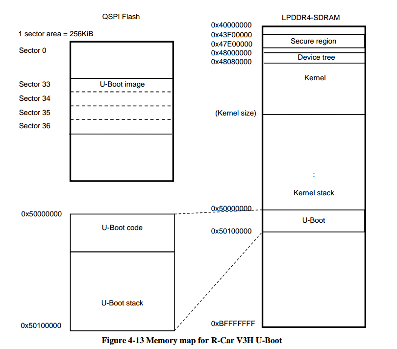
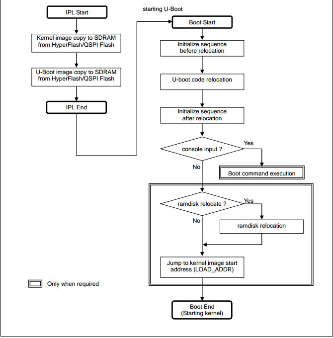
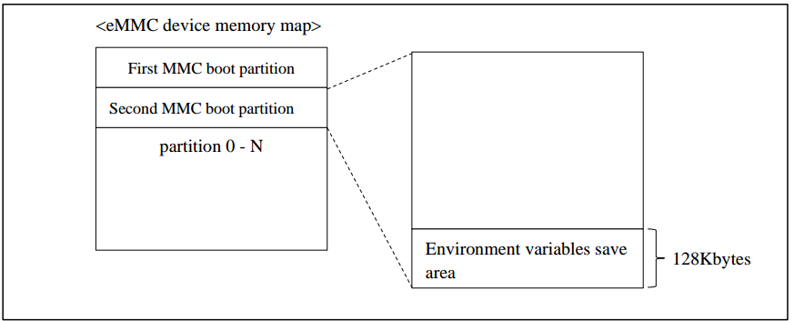
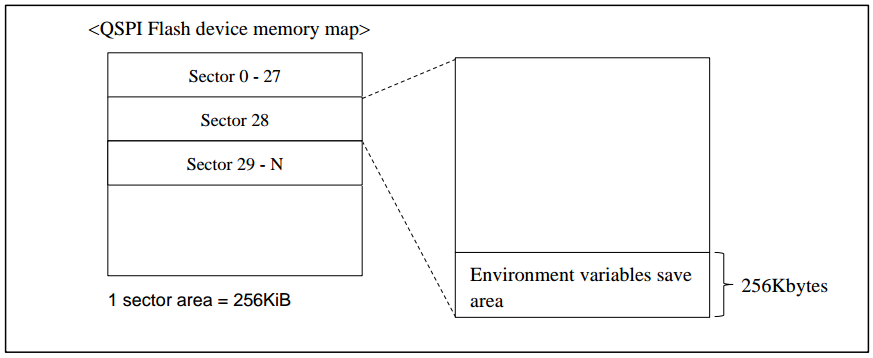
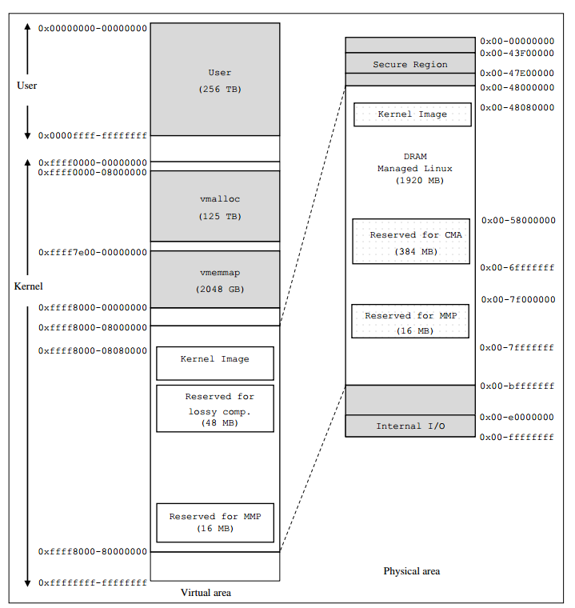

uboot-kernel地址空间
=======================

uboot地址空间
---------------

U-Boot image copy to LPDDR4-SDRAM from QSPI Flash by IPL

uboot在DDR中的地址空间
^^^^^^^^^^^^^^^^^^^^^^^^^

system boot sequence
^^^^^^^^^^^^^^^^^^^^^

emmc flash env
^^^^^^^^^^^^^^^^

kernel地址空间
----------------

arm64 物理地址与虚拟地址空间
^^^^^^^^^^^^^^^^^^^^^^^^^^^^^^^^^^

