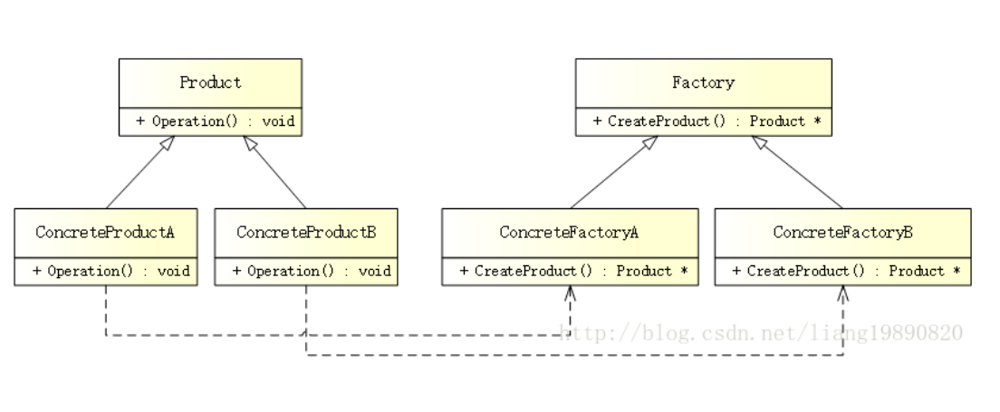

创新型模式之工厂方法模式
=============================

工厂方法模式(Factory Method Pattern)是一种常用的对象创建型设计模式，此模式的核心思想是封装类中不变的部分，提取其中个性化善变的部分为独立类，
通过依赖注入以达到解耦，复用以及方便后期维护拓展的目的．

模式结构
----------

 
- Factory(抽象工厂): 是工厂方法模式的核心，与应用程序无关．任何在模式中创建的对象的工厂类必须实现这个接口

- ConcreteFactory(具体工厂): 实现抽象工厂接口的具体工厂类, 包含与应用程序密切相关的逻辑，并且被应用程序调用以创建产品对象

- Product(抽象产品): 所创建对象的基类，也就是具体产品的共同父类或共同拥有的接口

- ConcreteProduct(具体产品): 实现来抽象产品角色所定义的接口．某具体产品有专门的具体工厂创建，他们之间往往一一对应

优缺点
---------

- 优点: 克服了简单工厂模式违背开放-封闭原则的缺点，又保留了封装对象创建过程的优点，降低客户端和工厂的耦合性．所以说，"工厂方法模式"是"简单
  工厂模式"的进一步抽象和推广

- 缺点: 每增加一个产品，相应的也要增加一个子工厂，加大了额外的开发量　

代码实现
-------------

- 创建抽象产品

在此示例中，创建一个汽车产品

::

    class ICar
    {
    public:
        virtual string Name() = 0;  //汽车名称
    }

- 创建具体产品

::

    class BenzCar : public ICar
    {
    public:
        string Name() {
            return "Benz Car";
        }
    }

    class BmwCar : public ICar
    {
    public:
        string Name() {
            return "Bmw Car";
        }
    }

- 创建工厂

::

    class AFactory
    {
    public:
        virtual ICar* CreateCar() = 0; //生产汽车
    }

- 创建具体工厂

::

    class BenzFactory : public AFactory
    {
    public:
        ICar* CreateCar() {
            return new BenzCar();
        }
    }

    class BmwFactory : public AFactory
    {
    public:
        ICar* CreateCar() {
            return new BmwCar();
        }
    }
