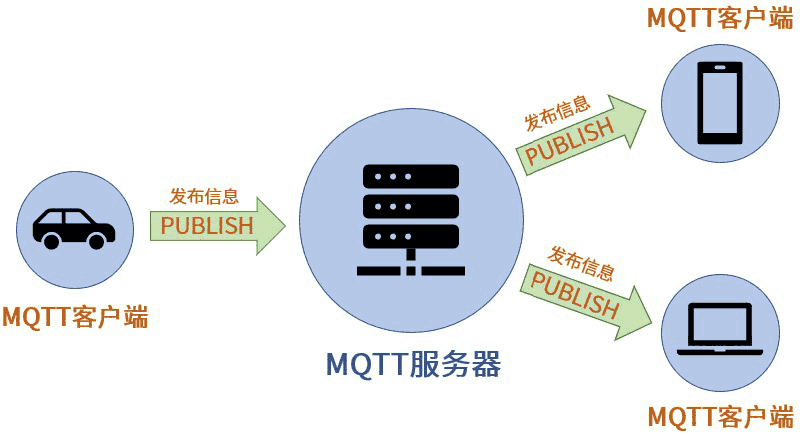

mqtt协议基础
===============

MQTT(消息队列遥测传输)是一种轻量级通讯协议，该协议一个重要特点是易于在客户端实现．广泛应用于车联网，智能家居，物联网领域．

MQTT基础原理
--------------

在MQTT协议通讯中，有两个最为重要的角色，他们分别是服务端和客户端

- MQTT服务端: 它是MQTT信息传输的枢纽，负责将MQTT客户端发送来的消息传递给MQTT客户端，MQTT服务端还负责管理MQTT客户端，确保客户端之间的通讯顺畅

- MQTT客户端: MQTT客户端可以向服务端发布消息，也可以从服务端接收消息．我们把客户端发送信息的行为称为"发布"消息，而客户端想要从服务端接收信息，则需要向服务端"订阅"消息

.. note::
    MQTT客户端在订阅消息时，MQTT服务端使用"主题"来控制

**MQTT发布/订阅特性**

- 相互可独立: MQTT客户端是一个个独立的个体，他们无需了解彼此的存在，依然可以实现信息交流

- 空间可分离: MQTT客户端在通讯时的必要条件是连接到了同一个MQTT通讯网络，这个网络可以是互联网或者局域网

- 时间可异步: MQTT客户端在发送和接收信息时无需同步．

MQTT客户端连接
^^^^^^^^^^^^^^^^^^

MQTT客户端连接服务端有两步

1. 首先是MQTT客户端将会向服务端发送连接请求，该请求实际上是一个包含有连接请求信息的数据包，这个数据包的官方名称为 ``CONNECT``

2. MQTT服务端收到客户端连接请求后，会向客户端发送连接确认，同样的，该确认也是一个数据包，这个数据包官方名称为 ``CONNACK``

**CONNECT-连接服务端**

CONNECT报文

=========================   ====================================================
 报文字段                               内容示例
-------------------------   ----------------------------------------------------
 clientId                       "client-1"
 cleanSession                   true
 username(可选)                 "test_sender"
 password(可选)                 "root"
 lastWillTopic(可选)            "/test_sender/will"
 lastWillQos(可选)              2
 lastWillMessage(可选)          "unexpected exit"
 lastWillRetain(可选)           false
 keepAlive(可选)                60
=========================   ====================================================

- ClientId是MQTT客户端的标识，MQTT服务端用该标识来识别客户端，所以ClientId必须是独立的

    
- cleanSession(清除会话), 在MQTT通讯中存在报文丢失的情况，为了报文可以准确无误的送达，服务端将会执行以下两个操作

1. 将尚未被客户端确认的报文保存起来

2. 再次尝试向客户端发送报文，并且再次等待客户端发送确认信息

如果cleanSession被设置为"true",那服务端不需要客户端确认收到报文，也不会保存任何报文，在这种情况下，一旦报文丢失便是永久性的丢失．
当cleanSession被设置为"false"，服务端将保存客户端未收到的报文

.. note::
    如果需要服务端保存报文，光设置cleanSession为false是不够的，还需要传递MQTT信息Qos级别大于0

- keepAlive(心跳时间间隔): 用于服务端实时了解客户端是否与其保持连接的情况

**CONNACK-确认连接请求**

======================  =======================================
    报文字段　                  内容示例
----------------------  ---------------------------------------
 sessionPresent                 true
 returnCode                     0
======================  =======================================

- returnCode(连接返回码): 当服务端收到客户端的连接请求后，会向客户端发送returnCode,用以说明连接情况

=============   =============================================================================================================================
 返回码　　                 说明
-------------   -----------------------------------------------------------------------------------------------------------------------------
 0                  连接成功
 1                  连接被服务端拒绝，原因是不支持客户端的MQTT协议版本
 2                  连接被服务端拒绝，原因是不支持客户端标识符的编码,如客户端使用UTF-8编码，但服务端不允许使用此编码
 3                  连接被服务端拒绝，原因是服务端不可用，即，网络连接已经建立，但MQTT服务不可用
 4                  连接被服务端拒绝，原因是用户名或密码无效
 5                  连接被服务端拒绝，原因是客户端未被授权连接到此服务端
=============   =============================================================================================================================

- sessionPresent(当前会话): 

  - 当cleanSession为true时，sessionPreset肯定是false 

  - 当cleanSession为false时，如果服务端的确保存了没有收到客户端接收确认的报文信息，那么cleanSession为true,否则为false

发布/订阅/取消订阅
^^^^^^^^^^^^^^^^^^^^^^

**PUBLISH-发布消息**

MQTT客户端一旦连接到服务端便可以发送消息，每条发布的MQTT消息必须包含一个主题，MQTT服务器可以通过主题确定将消息发给哪些客户端

=====================   =============================================================
 报文字段　                     内容实例
---------------------   -------------------------------------------------------------
 packetId                   4314
 topicName                  "topic_vehicle_speed"
 qos                        1
 retainFlag                 false
 payload                    "vehicle_speed:65.3"
 dupFlag                    false
=====================   =============================================================

- topicName: 主题名用于识别此消息应发布到哪一个主题

- qos(服务质量等级): QoS(Quality of Service)表示MQTT消息的服务质量等级，QoS有三个级别:0,1,2

- packetId(报文标识符): 报文标识符用于对MQTT报文进行标识，不同的MQTT报文所拥有的标识符不同

.. warning::
    报文标识符的内容与QoS级别有着密不可分的关系，只有qos级别大于0时，报文标识符才是非零数值，如果qos等于0,报文标识符为0

- reatinFlag(保留标志): 默认情况下，当客户端订阅了某一主题后并不会马上收到该主题的信息，只有在服务端接收到该主题的新的消息后才会将该消息推动给客户端.
  但有些情况下，我们需要客户端马上收到该主题的消息，那么需要用到该标志

- paload(有效载荷): MQTT发送的实际数据

- dupFlag(重发标志): 当MQTT报文的接收方没有及时发送收到报文时，发送方会重复发送MQTT报文．在重复发送MQTT报文时，发送方会将此"重发标志"设置为true

.. note::
    dupFlag只在QOS级别大于0时使用

**SUBSCRIBE-订阅主题**

客户端想要订阅主题，首先要向服务端发送主题订阅请求，客户端是向服务端发送 ``SUBSCRIBE`` 报文来实现这一情况．该报文含有一系列"订阅主题名"

**SUBACK-订阅确认**

服务端收到客户端的订阅报文后，会向客户端发送 ``SUBACK`` 报文确认订阅. SUBACK报文包含有returnCode(订阅返回码)和packetId(报文标识符)

================    =====================================
 返回码　               说明
----------------    -------------------------------------
 0                      订阅成功-qos 0
 1                      订阅成功-qos 1
 2                      订阅成功-qos 2
 128                    订阅失败
================    =====================================

**UNSUBSCRIBE-取消订阅**

当客户端要取消订阅某主题时，可通过向服务端发送 ``UNSUBSCRIBE`` 报文来实现

================    ======================================
 报文字段　　           实例内容
----------------    --------------------------------------
 packetId                   4315
 topic1                     "topic_1"
 topic2                     "topic_2"
================    ======================================

