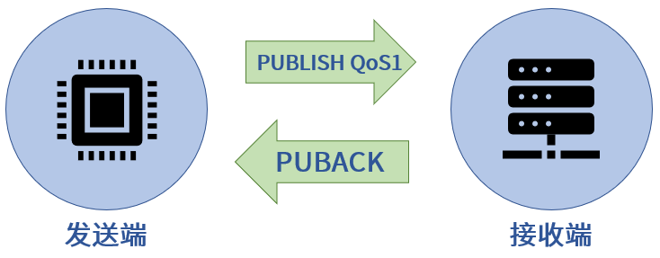
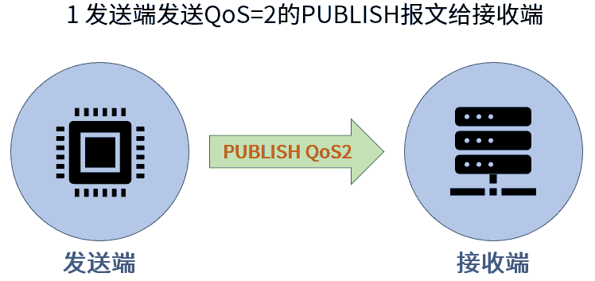
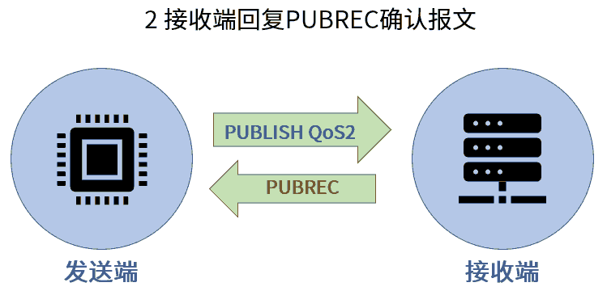
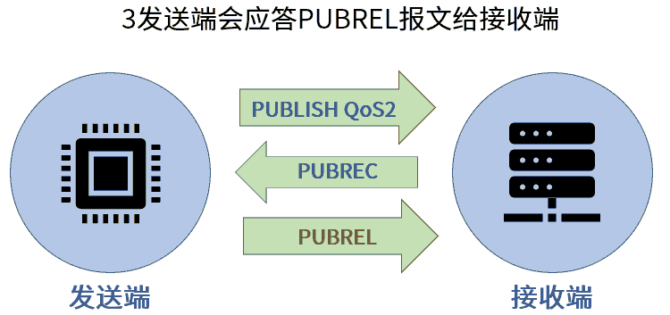
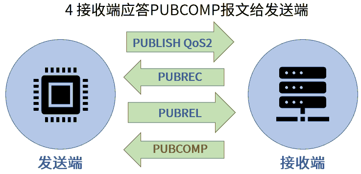
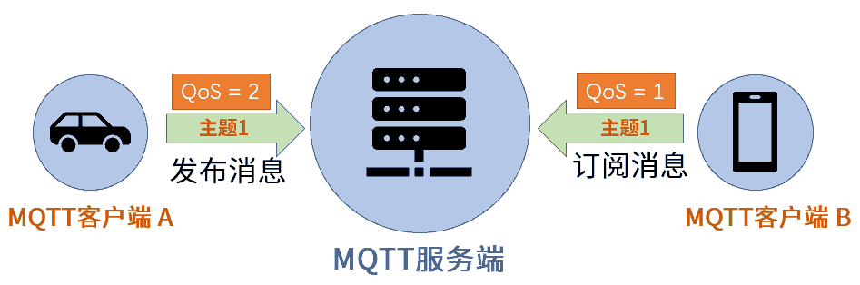
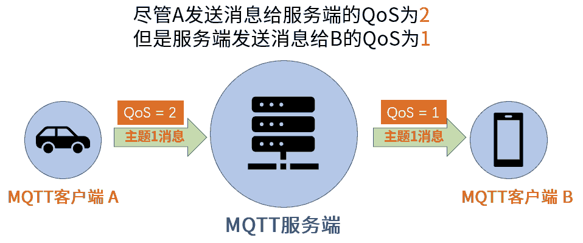
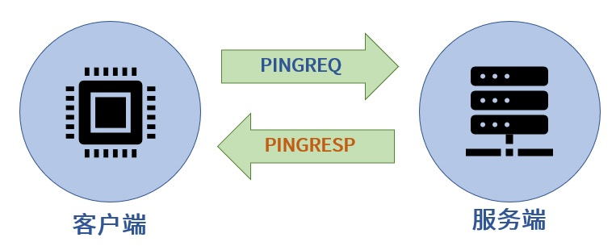

mqtt协议基础
===============

MQTT(消息队列遥测传输)是一种轻量级通讯协议，该协议一个重要特点是易于在客户端实现．广泛应用于车联网，智能家居，物联网领域．

MQTT基础原理
--------------

在MQTT协议通讯中，有两个最为重要的角色，他们分别是服务端和客户端

- MQTT服务端: 它是MQTT信息传输的枢纽，负责将MQTT客户端发送来的消息传递给MQTT客户端，MQTT服务端还负责管理MQTT客户端，确保客户端之间的通讯顺畅

- MQTT客户端: MQTT客户端可以向服务端发布消息，也可以从服务端接收消息．我们把客户端发送信息的行为称为"发布"消息，而客户端想要从服务端接收信息，则需要向服务端"订阅"消息

.. note::
    MQTT客户端在订阅消息时，MQTT服务端使用"主题"来控制

**MQTT发布/订阅特性**

- 相互可独立: MQTT客户端是一个个独立的个体，他们无需了解彼此的存在，依然可以实现信息交流

- 空间可分离: MQTT客户端在通讯时的必要条件是连接到了同一个MQTT通讯网络，这个网络可以是互联网或者局域网

- 时间可异步: MQTT客户端在发送和接收信息时无需同步．

MQTT客户端连接
^^^^^^^^^^^^^^^^^^

MQTT客户端连接服务端有两步

1. 首先是MQTT客户端将会向服务端发送连接请求，该请求实际上是一个包含有连接请求信息的数据包，这个数据包的官方名称为 ``CONNECT``

2. MQTT服务端收到客户端连接请求后，会向客户端发送连接确认，同样的，该确认也是一个数据包，这个数据包官方名称为 ``CONNACK``

**CONNECT-连接服务端**

CONNECT报文

=========================   ====================================================
 报文字段                               内容示例
-------------------------   ----------------------------------------------------
 clientId                       "client-1"
 cleanSession                   true
 username(可选)                 "test_sender"
 password(可选)                 "root"
 lastWillTopic(可选)            "/test_sender/will"
 lastWillQos(可选)              2
 lastWillMessage(可选)          "unexpected exit"
 lastWillRetain(可选)           false
 keepAlive(可选)                60
=========================   ====================================================

- ClientId是MQTT客户端的标识，MQTT服务端用该标识来识别客户端，所以ClientId必须是独立的

    
- cleanSession(清除会话), 在MQTT通讯中存在报文丢失的情况，为了报文可以准确无误的送达，服务端将会执行以下两个操作

1. 将尚未被客户端确认的报文保存起来

2. 再次尝试向客户端发送报文，并且再次等待客户端发送确认信息

如果cleanSession被设置为"true",那服务端不需要客户端确认收到报文，也不会保存任何报文，在这种情况下，一旦报文丢失便是永久性的丢失．
当cleanSession被设置为"false"，服务端将保存客户端未收到的报文

.. note::
    如果需要服务端保存报文，光设置cleanSession为false是不够的，还需要传递MQTT信息Qos级别大于0

- keepAlive(心跳时间间隔): 用于服务端实时了解客户端是否与其保持连接的情况

**CONNACK-确认连接请求**

======================  =======================================
    报文字段　                  内容示例
----------------------  ---------------------------------------
 sessionPresent                 true
 returnCode                     0
======================  =======================================

- returnCode(连接返回码): 当服务端收到客户端的连接请求后，会向客户端发送returnCode,用以说明连接情况

=============   =============================================================================================================================
 返回码　　                 说明
-------------   -----------------------------------------------------------------------------------------------------------------------------
 0                  连接成功
 1                  连接被服务端拒绝，原因是不支持客户端的MQTT协议版本
 2                  连接被服务端拒绝，原因是不支持客户端标识符的编码,如客户端使用UTF-8编码，但服务端不允许使用此编码
 3                  连接被服务端拒绝，原因是服务端不可用，即，网络连接已经建立，但MQTT服务不可用
 4                  连接被服务端拒绝，原因是用户名或密码无效
 5                  连接被服务端拒绝，原因是客户端未被授权连接到此服务端
=============   =============================================================================================================================

- sessionPresent(当前会话): 

  - 当cleanSession为true时，sessionPreset肯定是false 

  - 当cleanSession为false时，如果服务端的确保存了没有收到客户端接收确认的报文信息，那么cleanSession为true,否则为false

发布/订阅/取消订阅
^^^^^^^^^^^^^^^^^^^^^^

**PUBLISH-发布消息**

MQTT客户端一旦连接到服务端便可以发送消息，每条发布的MQTT消息必须包含一个主题，MQTT服务器可以通过主题确定将消息发给哪些客户端

.. image::
    res/MQTT-PUBLISH.png

=====================   =============================================================
 报文字段　                     内容实例
---------------------   -------------------------------------------------------------
 packetId                   4314
 topicName                  "topic_vehicle_speed"
 qos                        1
 retainFlag                 false
 payload                    "vehicle_speed:65.3"
 dupFlag                    false
=====================   =============================================================

- topicName: 主题名用于识别此消息应发布到哪一个主题

- qos(服务质量等级): QoS(Quality of Service)表示MQTT消息的服务质量等级，QoS有三个级别:0,1,2

- packetId(报文标识符): 报文标识符用于对MQTT报文进行标识，不同的MQTT报文所拥有的标识符不同

.. warning::
    报文标识符的内容与QoS级别有着密不可分的关系，只有qos级别大于0时，报文标识符才是非零数值，如果qos等于0,报文标识符为0

- reatinFlag(保留标志): 默认情况下，当客户端订阅了某一主题后并不会马上收到该主题的信息，只有在服务端接收到该主题的新的消息后才会将该消息推动给客户端.
  但有些情况下，我们需要客户端马上收到该主题的消息，那么需要用到该标志

- paload(有效载荷): MQTT发送的实际数据

- dupFlag(重发标志): 当MQTT报文的接收方没有及时发送收到报文时，发送方会重复发送MQTT报文．在重复发送MQTT报文时，发送方会将此"重发标志"设置为true

.. note::
    dupFlag只在QOS级别大于0时使用

**SUBSCRIBE-订阅主题**

客户端想要订阅主题，首先要向服务端发送主题订阅请求，客户端是向服务端发送 ``SUBSCRIBE`` 报文来实现这一情况．该报文含有一系列"订阅主题名"

**SUBACK-订阅确认**

服务端收到客户端的订阅报文后，会向客户端发送 ``SUBACK`` 报文确认订阅. SUBACK报文包含有returnCode(订阅返回码)和packetId(报文标识符)

================    =====================================
 返回码　               说明
----------------    -------------------------------------
 0                      订阅成功-qos 0
 1                      订阅成功-qos 1
 2                      订阅成功-qos 2
 128                    订阅失败
================    =====================================

**UNSUBSCRIBE-取消订阅**

当客户端要取消订阅某主题时，可通过向服务端发送 ``UNSUBSCRIBE`` 报文来实现

================    ======================================
 报文字段　　           实例内容
----------------    --------------------------------------
 packetId                   4315
 topic1                     "topic_1"
 topic2                     "topic_2"
================    ======================================

MQTT主题
-----------

- 主题的基本形式就是一个字符串

.. note::
    1. 主题是区分大小写的

    2. 主题可以使用空格,如"current time"

    3. 大部分MQTT服务端是不支持中文主题的

- 主题分级

为了更好的对主题进行管理和分类，我们可以对主题进行分级处理，MQTT主题各个级别之间可以使用"/"来分割．如"typer-1/motor/1/speed", 此
示例中共有四级主题

- 主题通配符

当客户端订阅主题时，可以使用通配符同时订阅多个主题，通配符只能在订阅主题时使用．通配符分为单级通配符和多级通配符

1. 单级通配符( ``+`` ): 单级通配符可以替代一个主题级别

::

    home/control/led
    home/sensor/kitchen/temperature 
    home/sensor/bedroom/temperature 
    home/sensor/livingroom/temperature 
    home/sensor/rawdata
    office/sensor/livingroom/temperature 
    ##以上为所有主题
    ##当使用home/sensor/+/temperature订阅主题时，可以收到以下主题的消息
    home/sensor/kitchen/temperature 
    home/sensor/bedroom/temperature 
    home/sensor/livingroom/temperature 

2. 多级通配符( ``#`` ): 多级通配符可以涵盖任意数量的主题级别

::

    home/control/led
    home/sensor/kitchen/temperature 
    home/sensor/bedroom/temperature 
    home/sensor/livingroom/temperature 
    home/sensor/rawdata
    office/sensor/livingroom/temperature 
    ##以上为所有主题
    ##当使用home/# 订阅主题时，可以收到以下主题的消息
    home/control/led
    home/sensor/kitchen/temperature 
    home/sensor/bedroom/temperature 
    home/sensor/livingroom/temperature 
    home/sensor/rawdata

.. warning::
    多级通配符必须是主题中的最后一个字符

.. note::
    1. 以 ``$`` 开始的主题是MQTT服务端系统保留的特殊主题，我们不能随意订阅或者向其发布消息

    2. 不要用"/"作为主题开头，MQTT运行使用"/"作为主题开头，但这么做毫无意义，并且会额外产生一个没用的主题级别

    3. 主题中不要使用空格，虽然这样合规，但会使得阅读和调试变得困难

QoS服务质量等级
-----------------

MQTT服务质量(Quality of Service)用于告知物联网系统，哪些信息是重要信息需要准确无误的传输，而哪些信息不那么重要，即使丢失也没有问题

MQTT协议有三种服务质量级别:

- QoS = 0 : 最多发一次

- Qos = 1 : 最少发一次

- Qos = 2 : 保证收一次

------------------------------------------------------------------------------------------------------------------------------------------------------

Qos = 0 : 最多发一次

0是服务质量QoS的最低级别，此时，MQTT不能保证所有信息都得以传输，也就是说发送端一旦发送消息后，并不会检查消息是否被正常接收

------------------------------------------------------------------------------------------------------------------------------------------------------

Qos = 1 : 最少发一次

当QoS级别为1时，发送端在消息发送完成后，会检查接收端是否已经成功接收到了消息．

发送端将消息发送给接收端后，会等待接收端的确认．接收端成功接收消息后，会发送一条确认报文 ``PUBACK`` 给发送端．如果发送端收到了
确认报文，那么便认为是消息已经成功接收. 当过了一段时间没有收到确认报文，会重复发送一条消息

=============== ==============================
 PUBACK字段　           内容
--------------- ------------------------------
 packetId               4319
=============== ==============================

当重复发送一条消息时，PUBLISH报文中的 ``dupFlag`` 会被设置为true, 以此通知接收端此消息为重复发送

------------------------------------------------------------------------------------------------------------------------------------------------------

QoS = 2 : 保证收一次

2级服务质量时，MQTT协议可以保证接收端只接收一次消息，是最安全的服务级别，也是最慢的服务级别

设置QoS
^^^^^^^^^

1. 客户端发布消息时， ``PUBLISH`` 数据包中有一个 ``qos`` 字段，该字段用于设置客户端发布MQTT消息的QoS等级

2. 客户端在订阅MQTT主题时， ``SUBSCRIBE`` 数据包中也同样有一个字段用于设置订阅主题的QoS级别

另外要想实现QoS>0的MQTT通讯，客户端在连接服务端时，必须要将cleanSession设置为false

------------------------------------------------------------------------------------------------------------------------------------------------------

当消息的发布者和订阅者使用不同级别的QoS时，会发生服务质量降级

保留消息
---------

要讲明“保留消息”这一概念，我们先看一个场景。假设我们正在利用MQTT协议开发一套智能家居物联网系统。在该系统中有一台专门用于检测和发布室温信息的MQTT客户端，它每到整点时就会测量当前室温并且向MQTT服务端发布室温测量结果。

假设在该智能家具物联网系统中，还有一台环境信息显示客户端。这台客户端的作用就是把当前的室温显示在屏幕上以便我们实时了解室内温度。换句话说，这台环境信息显示客户端一启动就会订阅室温主题，这样室温检测客户端一发布消息，显示客户端就能获取到最新的温度消息并显示在屏幕上了。

假设某天上午7：00，我们的室温检测客户端将最新的室温消息发布到了服务端，那么订阅了室温消息的显示客户端也就马上获取到室温消息并且显示在屏幕上。

然而在7：10的时候，家里的小狗不小心把显示客户端的电源碰掉了，显示客户端没有电也就自动关机了。我们发现这一问题后，马上把显示客户端重新通电，客户端通电启动后会立刻订阅室温主题。

但这时候问题出现了，室温测量客户端每到整点才发布一次温度信息。上一次发布时间是7：00，下一次发布时间是8：00。所以，尽管显示客户端订阅了室温主题，它还要等到8：00钟才能收到最新室温消息。在8：00前的几十分钟里，显示客户端无法获知当前室温信息，也就无法将室温信息显示在屏幕上供我们查阅。

为了避免以上情况出现，我们可以让室温测量客户端在每次向室温主题发布消息时都使用“保留消息”这一模式将温度信息发布到服务端。这样无论显示客户端在任何时间订阅室温主题，都会马上收到该主题中的“保留消息”，也就是温度测量客户端发布的最新室温消息。

- 在 ``PUBLISH`` 报文中 ``retainFlag`` 字段用于设置是否为保留消息

.. warning::
    1. 每个主题只能有一个保留消息，如果客户端想要更新保留消息，就需要向该主题发送一条信息的保留消息，服务端会将新的消息覆盖旧的保留消息

    2. 如果想要删除主题的保留消息，则需要向该主题发布一条空的保留消息，即发送0字节payload保留消息

心跳机制
---------

在MQTT通信机制中，当客户端没有消息向服务端发送时，可以定时向服务端发送一条消息，这条消息也被称为心跳请求( ``PINGREQ`` ).
用于通知服务端，当前客户端依然在线．服务端在收到客户端的心跳请求后，会回复一条消息，也称心跳响应( ``PINGRESP`` )

1. 如果在心跳间隔内有消息发送到服务端则不需要发送心跳请求.

2. 实际运行中，如果服务端没有在1.5倍心跳时间间隔内没有收到PINGREQ请求，那么会认为该客户端已掉线

3. 同时客户端也可以利用此机制判断自己与服务端是否保持连接，当发送心跳请求后没有收到心跳确认则认为自己已经断开与服务端的连接

MQTT遗嘱
-----------

当客户端正常断开连接时，会向服务端发送 ``DISCONNECT`` 报文. 当客户端意外断线时，服务端会发布客户端的遗嘱消息

在客户端连接服务端时，会发送 ``CONNECT`` 报文，此报文字段中包含 ``lastWillTopic`` ``lastWillQos`` ``lastWillMessage`` ``lastWillRetain`` ，
这些称为遗嘱消息

- lastWillTopic: 与普通的MQTT主题类似,只有订阅了此主题的客户端才会收到遗嘱消息

- lastWillMessage: 遗嘱消息内容

- lastWillQoS: 遗嘱QoS

- lastWillRetain: 遗嘱保留，遗嘱消息也可以设置为保留消息

MQTT用户密码认证
-------------------

有些MQTT服务端需要客户端在连接时提供用户名和密码

