MQTT报文
===========

MQTT控制报文格式
-------------------

MQTT协议通过交换预定义的MQTT控制报文来通信，MQTT控制报文由三部分组成

- Fixed Header: 固定报头，所有控制报文都包含

- Variable Header: 可变报头，部分控制报文包含

- Payload: 有效载荷，部分控制报文包含

固定报头
^^^^^^^^^^

- 固定报头格式

===========  ==== ==== ==== ==== ==== ==== ==== ====
 比特位　      7    6    5    4   3    2     1   0
-----------  ---- ---- ---- ---- ---- ---- ---- ----
 byte 1        MQTT控制报文类型 　标志位
-----------  ------------------- -------------------
 btye 2..      剩余长度
===========  =======================================

- MQTT控制报文类型

=================   =========   ================    ==========================================================================================
 名字　　               值　     报文流动方向　                 描述
-----------------   ---------   ----------------    ------------------------------------------------------------------------------------------
 Reserved               0           禁止
 CONNECT                1           C------>S         客户端请求连接服务端
 CONACK                 2           S------>C         连接报文确认
 PUBLISH                3           C<----->S         发布消息
 PUBACK                 4           C<----->S         QOS 1消息发布收到确认
 PUBREC                 5           C<----->S         发布收到(保证交付第一步)
 PUREL                  6           C<----->S         发布释放(保证交付第二步)
 PUBCOMP                7           C<----->S         QOS 2消息发布完成(保证交付第三步)
 SUBSCRIBE              8           C------>S         客户端订阅请求
 SUBACK                 9           S------>C         订阅请求报文确认
 UNSUBSCRIBE            10          C------>S         客户端取消订阅请求
 UNSUBACK               11          S------>C         取消订阅报文确认
 PINGREQ                12          C------>S         心跳请求
 PINGRESP               13          S------>C         心跳响应
 DISCONNECT             14          C<----->S         断开连接通知
 AUTH                   15          C<----->S         认证信息交换
=================   =========   ================    ==========================================================================================

- 标志位

================ ============================= ======= ======= ======= ======== 
 控制报文　         固定报头标志　              b3      b2      b1       b0
---------------- ----------------------------- ------- ------- ------- --------
 PUBLISH           used in mqtt v3.1.1          dup       qos           retain
---------------- ----------------------------- ------- --------------- --------
 PUBREL           Reserved                      0       0       1       0
 SUBSCRIBE        Reserved                      0       0       1       0
 UNSUBSCRIBE      Reserved                      0       0       1       0
================ ============================= ======= ======= ======= ======== 

.. note::
    1. dup:控制报文重发的标志

    2. qos:PUBLISH报文的服务质量等级

    3. retain:PUBLISH报文保留标志,用于保留消息发送

- 剩余长度: 从第二字节开始，是一个变长字节的整数，用于表示当前控制报文剩余部分的字节数，包含可变报头和负载的数据

可变报头(Variable Header)
^^^^^^^^^^^^^^^^^^^^^^^^^^^^^^^^

可变报头部分包含了2个字节的报文标识符字段

=================== ====================================
 控制类型　　           是否需要标识符字段
------------------- ------------------------------------
 CONNECT                否
 CONNACK                否
 PUBLISH                是(如果QOS>0)
 PUBACK                 是
 PUBREC                 是
 PUBREL                 是
 PUBCOMP                是
 SUBSCRIBE              是
 SUBACK                 是
 UNSUBSCRIBE            是
 UNSUBACK               是
 PINGREQ                否
 PINGRESP               否
 DISCONNECT             否
 AUTH                   否
=================== ====================================

::
    
    Client                                      Server
    PUBLISH Packet Identifier = 0x1234  ----->
          <----- PUBLISH Packet Identifier = 0x1234
    PUBACK Packet Identifier = 0x1234   ----->
          <----- PUBACK Packet Identifier = 0x1234

Payload
^^^^^^^^^^^

=================== ====================================
 控制类型　　           是否需要payload
------------------- ------------------------------------
 CONNECT                是
 CONNACK                否
 PUBLISH                可选
 PUBACK                 否
 PUBREC                 否
 PUBREL                 否
 PUBCOMP                否
 SUBSCRIBE              是
 SUBACK                 是
 UNSUBSCRIBE            是
 UNSUBACK               否
 PINGREQ                否
 PINGRESP               否
 DISCONNECT             否
=================== ====================================

MQTT控制报文
-------------------

CONNECT - 客户端请求连接服务器
^^^^^^^^^^^^^^^^^^^^^^^^^^^^^^^^

每个客户端只能发送一次CONNECT包，服务端会把此客户端再次发送的CONNECT包当作违反协议处理，并断开与此客户端的连接

- 固定报头: CONNECT包头

- 可变报头: 协议名字，协议等级，连接标识，保持连接

.. image::
    res/connect_options.png

- 载荷: CONNECT包的载荷可以包含一个或多个带有长度前缀的字段，这取决于可变包头的标识，这些字段如果存在，必须按照这样的顺序(1.客户端唯一标识 2.Will Topic 
  3.Will Message 4.User Name 5.Password)
    

CONNACK - 确认收到连接请求
^^^^^^^^^^^^^^^^^^^^^^^^^^^^

CONNACK包是服务端发送的用来响应客户端CONNECT包的一种数据包，从服务端发送到客户端的第一个包一定是CONNACK包. 

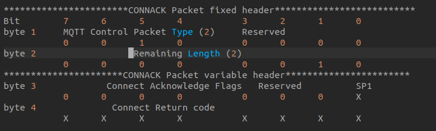

.. note::
    字节3是连接确认标识，为7-1是保留位必须设置为0，位0(SP1)是session present标识

1. 如果服务端接受了一个CleanSession设置为1的连接，服务端必须将CONNACK包中的session present设置为0，并且CONNACK包的返回码也设置为0.

2. 如果服务端接受了一个CleanSession设置为0的连接，session present的值取决于服务端是否已经存储了客户端ID对应的会话状态．如果已经存储，
   session present必须设置为1,否则设置为0,另外CONNACK返回码也必须设置为0

PUBLISH - 发布消息
^^^^^^^^^^^^^^^^^^^

PUBLISH控制包可以从服务端发送到客户端也可以从客户端发送到服务端

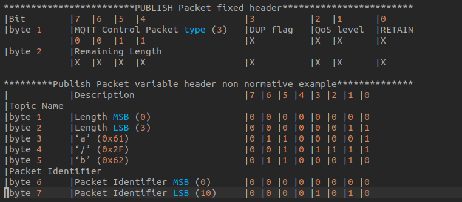

载荷包含了发布的应用消息，内容和格式由应用决定．载荷的长度可以由固定包头中的Remaining Length减去可变包头长度得到

PUBLISH包的接收方需要按照下表进行响应

=================   =====================================
 QoS Level                  Expected Respinse
-----------------   -------------------------------------
 QoS 0                  None
 QoS 1                  PUBACK Packet
 QoS 2                  PUBREC Packet
=================   =====================================

PUBACK - 发布确认
^^^^^^^^^^^^^^^^^^^^

PUBACK包用来响应QoS等级为1的PUBLISH包

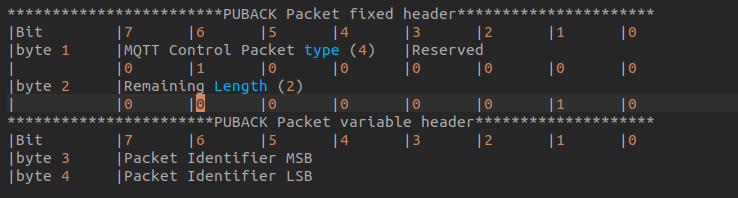

PUBREC - 发布收到
^^^^^^^^^^^^^^^^^^^

PUBREC包用来响应QoS 2的PUBLISH包，这是QoS 2协议交换的第二个包

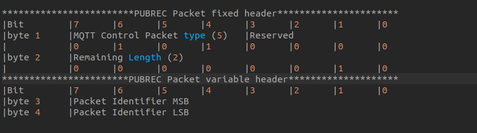

PUBREL - Publish release
^^^^^^^^^^^^^^^^^^^^^^^^^^

PUBREL包用来响应PUBREC包，是QoS 2协议交换的第三部分

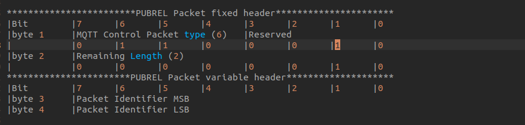

PUBCOMP - 发布完成
^^^^^^^^^^^^^^^^^^^^^

PUBCOMP包用来响应PUBREL包，这是QoS 2协议交换的第四个也是最后一个包

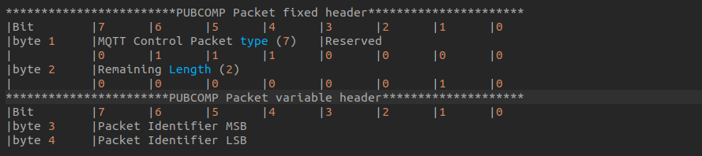

SUBSCRIBE - 订阅主题
^^^^^^^^^^^^^^^^^^^^^^^

SUBSCRIBE包从客户端发送到服务端创建一个或多个订阅

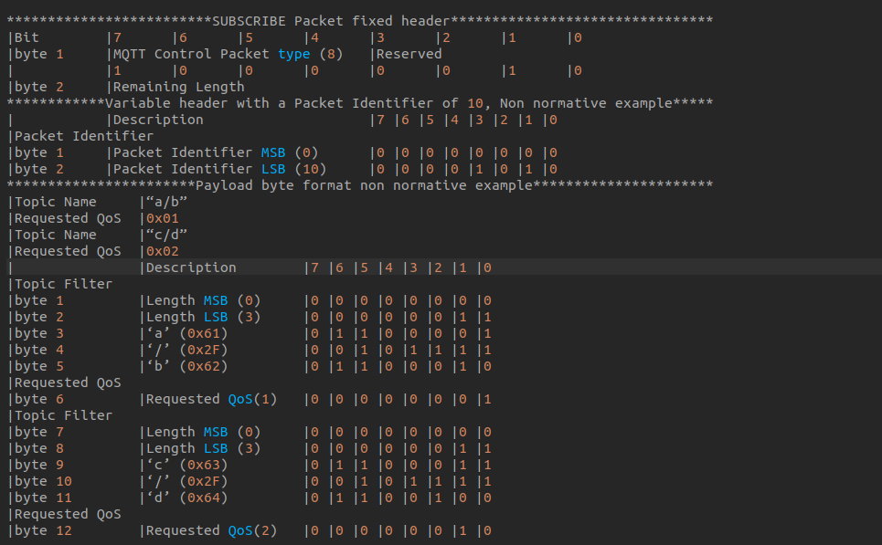

SUBACK - 订阅确认
^^^^^^^^^^^^^^^^^^^^

SUBACK包从服务端发送给客户端，用来确认收到并处理了SUBSCRIBE包，且必须包含与相应SUBSCRIBE包相同的包唯一标识

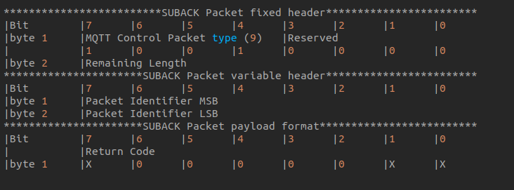

.. note::
    载荷包含了返回码的列表，每个返回码对应SUBSCRIBE包中需要被确认的主题，SUBACK中的返回码顺序必须匹配SUBSCRIBE包中的主题顺序

UNSUBSCRIBE - 退订主题
^^^^^^^^^^^^^^^^^^^^^^^^

UNSUBSCRIBE包从客户端发往服务端，用来退订主题

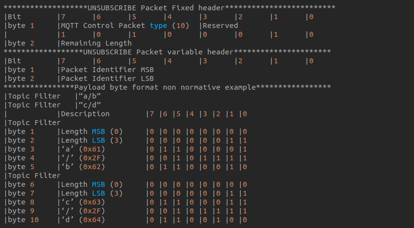

UNSUBACK - 退订确认
^^^^^^^^^^^^^^^^^^^^^

UNSUBACK包从服务端发送到客户端来确认收到UNSUBSCRIBE包

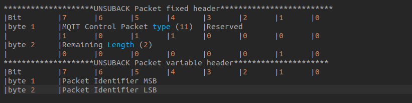

PINGREQ - PING请求
^^^^^^^^^^^^^^^^^^^^

PINGREQ包从客户端发往服务端，可以用来

1. 在没有其他控制包从客户端发往服务端时，告知服务端客户端的存活状态

2. 请求服务端响应，来确认服务端是否存活　

3. 确认网络连接的有效性

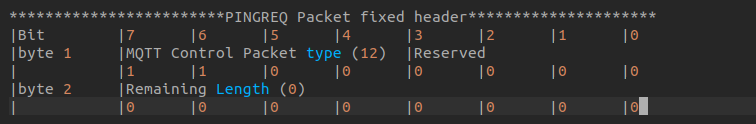

PINGRESP - PING响应
^^^^^^^^^^^^^^^^^^^^^

PINGRESP包从服务端发送给客户端来响应PINGREQ包，它代表服务端是存活的

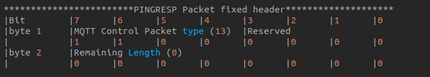

DISCONNECT - 断开连接通知
^^^^^^^^^^^^^^^^^^^^^^^^^^

DISCONNECT包是客户端发送给服务端的最后一个控制包

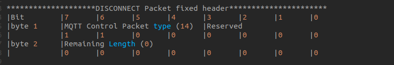

