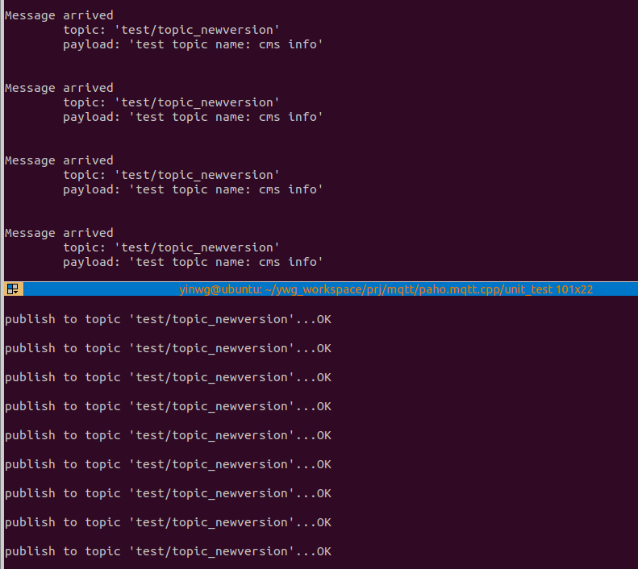

MQTT应用示例
==============

MQTT Client库编译安装
------------------------

Paho MQTT C++是Eclipse Paho MQTT客户端库的C++版本,源码编译安装步骤如下

- 安装依赖项

::
    
    sudo apt-get install build-essential gcc make cmake cmake-gui cmake-curses-gui
    #如果需要安全传输，则需要安装openssl
    sudo apt-get install libssl-dev

- 在构建 C++ 库之前，首先构建并安装 Paho C 库

::

    git clone https://github.com/eclipse/paho.mqtt.c.git
    cd paho.mqtt.c
    git checkout v1.3.8
    cmake -Bbuild -H. -DPAHO_ENABLE_TESTING=OFF -DPAHO_BUILD_STATIC=OFF \
    -DPAHO_WITH_SSL=OFF -DPAHO_HIGH_PERFORMANCE=ON -DCMAKE_INSTALL_PREFIX=./build/_install
    sudo cmake --build build/ --target install
    sudo ldconfig

.. note::
    新版本的 C++ 库需要 Paho C v1.3.8 或更高版本。

- 编译Paho C++ library

::

    git clone https://github.com/eclipse/paho.mqtt.cpp
    cd paho.mqtt.cpp

    cmake -Bbuild -H. -DPAHO_BUILD_STATIC=OFF -DPAHO_BUILD_DOCUMENTATION=OFF \
      -DPAHO_BUILD_SAMPLES=OFF -DCMAKE_WITH_SSL=OFF -DCMAKE_PREFIX_PATH=./build/_install

    cd build/
    cmake ../
    或
    cmake -DCMAKE_CXX_COMPILER=aarch64-poky-linux-g++ ../

Paho library应用示例
-----------------------

publish
^^^^^^^^^^

::

    #include <iostream>
    #include <cstring>
    #include <cstdlib>
    #include <unistd.h>
    #include "mqtt/async_client.h"

    //const std::string ADDRESS { "tcp://localhost:1883" };
    const std::string ADDRESS { "tcp://broker.hivemq.com:1883" };
    const std::string CLIENT_ID { "paho_cpp_async_publish" };
    const std::string TOPIC { "test/topic_newversion" };
    const int QOS = 1;

    class callback : public virtual mqtt::callback
    {
    public:
        virtual void connection_lost(const std::string& cause) override {
            std::cout << "\nConnection lost" << std::endl;
            if (!cause.empty())
                std::cout << "\tcause: " << cause << std::endl;
        }

        virtual void message_arrived(mqtt::const_message_ptr msg) override {
            std::cout << "\nMessage arrived" << std::endl;
            std::cout << "\ttopic: '" << msg->get_topic() << "'" << std::endl;
            std::cout << "\tpayload: '" << msg->to_string() << "'\n" << std::endl;
        }

        virtual void delivery_complete(mqtt::delivery_token_ptr token) override {
            std::cout << "\nDelivery complete for token: "
                << (token ? token->get_message_id() : -1) << std::endl;
        }
    };

    int main(int argc, char* argv[])
    {
        std::string test_topic = "test topic name: cms info";
        mqtt::async_client client(ADDRESS, CLIENT_ID);
        callback cb;
        client.set_callback(cb);

        mqtt::connect_options connOpts;
        connOpts.set_keep_alive_interval(20);
        connOpts.set_clean_session(true);

        try {
            std::cout << "Connecting to the MQTT server..." << std::flush;
            client.connect(connOpts)->wait();
            std::cout << "OK\n" << std::endl;

            while (true) {
                std::cout << "publish to topic '" << TOPIC << "'..." << std::flush;
                client.publish(TOPIC, test_topic.c_str(), test_topic.length())->wait();
                std::cout << "OK\n" << std::endl;
                sleep(5);
            }

            std::cout << "Disconnecting from the MQTT server..." << std::flush;
            client.disconnect()->wait();
            std::cout << "OK" << std::endl;

        }
        catch (const mqtt::exception& exc) {
            std::cerr << exc.what() << std::endl;
            return EXIT_FAILURE;
        }

        return EXIT_SUCCESS;
    }

subscribe
^^^^^^^^^^

::

    #include <iostream>
    #include <cstring>
    #include <cstdlib>
    #include <unistd.h>
    #include "mqtt/async_client.h"

    //const std::string ADDRESS { "tcp://localhost:1883" };
    const std::string ADDRESS { "tcp://broker.hivemq.com:1883" };
    const std::string CLIENT_ID { "paho_cpp_async_subcribe" };
    const std::string TOPIC { "test/topic_newversion" };
    const int QOS = 1;

    class callback : public virtual mqtt::callback
    {
    public:
        virtual void connection_lost(const std::string& cause) override {
            std::cout << "\nConnection lost" << std::endl;
            if (!cause.empty())
                std::cout << "\tcause: " << cause << std::endl;
        }

        virtual void message_arrived(mqtt::const_message_ptr msg) override {
            std::cout << "\nMessage arrived" << std::endl;
            std::cout << "\ttopic: '" << msg->get_topic() << "'" << std::endl;
            std::cout << "\tpayload: '" << msg->to_string() << "'\n" << std::endl;
        }

        virtual void delivery_complete(mqtt::delivery_token_ptr token) override {
            std::cout << "\nDelivery complete for token: "
                << (token ? token->get_message_id() : -1) << std::endl;
        }
    };

    int main(int argc, char* argv[])
    {
        mqtt::async_client client(ADDRESS, CLIENT_ID);
        callback cb;
        client.set_callback(cb);

        mqtt::connect_options connOpts;
        connOpts.set_keep_alive_interval(20);
        connOpts.set_clean_session(true);

        try {
            std::cout << "Connecting to the MQTT server..." << std::flush;
            client.connect(connOpts)->wait();
            std::cout << "OK\n" << std::endl;

            std::cout << "Subscribing to topic '" << TOPIC << "'..." << std::flush;
            client.subscribe(TOPIC, QOS)->wait();
            std::cout << "OK\n" << std::endl;

            while (true) {
                sleep(1);
            }

            std::cout << "Disconnecting from the MQTT server..." << std::flush;
            client.disconnect()->wait();
            std::cout << "OK" << std::endl;

        }
        catch (const mqtt::exception& exc) {
            std::cerr << exc.what() << std::endl;
            return EXIT_FAILURE;
        }

        return EXIT_SUCCESS;
    }

**编译**

::

     g++ -o publish publish.cpp -lpaho-mqttpp3 -lpaho-mqtt3as -I../src/ -L../paho.mqtt.c/build/src -L../build/src
     g++ -o subscribe subscribe.cpp -lpaho-mqttpp3 -lpaho-mqtt3as -I../src/ -L../paho.mqtt.c/build/src -L../build/src

**运行状态**

MQTT服务端(代理)编译
-----------------------

EMQ X是一款开源的，高性能，可扩展的分布式MQTT消息服务器，可以支持千万级的并发连接和百万级的消息推送．

EMQ依赖项安装
^^^^^^^^^^^^^^^

::

    sudo apt update
    sudo apt install software-properties-common apt-transport-https
    wget -O- https://packages.erlang-solutions.com/ubuntu/erlang_solutions.asc | sudo apt-key add -
    echo "deb https://packages.erlang-solutions.com/ubuntu focal contrib" | sudo tee /etc/apt/sources.list.d/erlang.list

    sudo apt update
    sudo apt install erlang

EMQ编译
^^^^^^^^^

::

    git clone https://github.com/emqx/emqx.git
    cd qmqx
    make
    make dist

