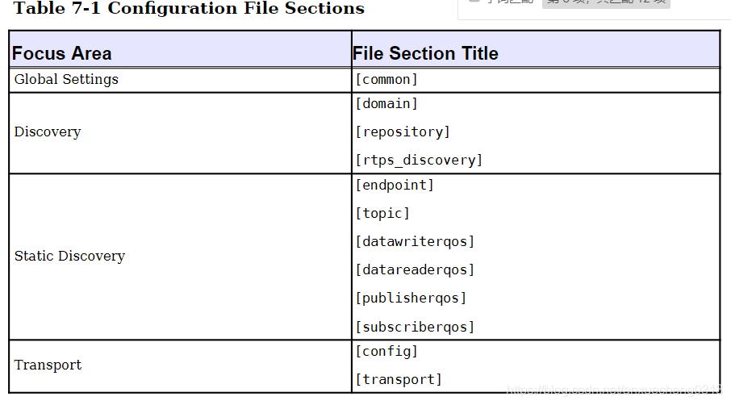

opendds配置选项
==================

配置文件应用示例

::

    ./publisher -DCPSConfigFile pub.ini

指令参数将在domain participant factor初始化时传递．

::

    #include <dds/DCPS/Server_Participant.h>
    int main(int argc, char* argv[])
    {
        DDS::DomainParticipantFactory_var dpf = TheParticipantFactoryWithArgs(argc, argv);
    }

配置文件内容示例

::

    [conmon]
    DCPSDebugLevel=0
    DCPSInfoRepo=localhost:12345
    DCPSLivelinessFactory=80
    DCPSChunks=20
    DCPSChunksAssociationMultiplier=10
    DCPSBitLookupDurationMesc=2000
    DCPSPendingTimeout=30

Global Setting
----------------

[common]
^^^^^^^^^^^^^^^

=================================== ===================================================================================================    ======================= 
    配置选项　                              描述                                                                                                默认值
----------------------------------- ---------------------------------------------------------------------------------------------------    ----------------------- 
 DCPSBit=[1|0]                        切换内置主题支持                                                                                              1
 DCPSBItLookupDurationMsec=msec       解读当前实例所给出的topic的最长持续时间　                                                                     2000ms
 DCPSBitTransportIPAddress=addr     　设定tcp传输的ip地址, 只对DCPSInfoRepo设定有效                                                                 INADDR_ANY
 DCPSBitTransportPort=port            TCP传输中端口号设定，如果使用默认值0，则操作系统来选择要使用的端口，只对DCPSInfoRepo设定有效                  0
 DCPSChunks=n                         当RESOURCE_LIMITS Qos值为无穷大时，数据写入者和读取者的缓存分配器将预分配的块的可配置数量．当所
                                      有预分配的块都在使用时，opendds从堆中进行分配                                                                 20
 DCPSChunkAssociationMultiplier=n     与DCPSChunks或resource_limits.max_samples相乘的值，以确定已预先分配的浅拷贝块的总数．                         10
 DCPSDebugLevel=n                     控制DCPS层打印的调试信息量的整数值．有效值0-10．                                                              0
 DCPSDefaultAddress=addr              
 DCPSDefaultDiscovery=[]              指定用于未明确配置的任何域的发现配置．可选值为DEFAULT_REPO|DEFAULT_REPS|DEFAULT_STATIC                  DEFAULT_REPO
 DCPSGlobalTransportConfig=name       设置应该用作全局配置的传输配置的名称
 DCPSInfoRepo=objref                  用于查找DCPS信息存储库的对象引用，可以是完整的CORBA IOR也可以是简单的host: port字符串　               　file://repo.ior
 DCPSLivelinessFactory=n              
 DCPSMonitor=[0|1]                    使用OpenDDS_Monitor库发布有关监视主题的数据　                                                                 0
 DCPSPendingTimeout=sec               数据写入器将阻塞的最大持续时间(以秒为单位)                                                                    0
 DCPSPersistentDataDir=path           文件系统上将存储持久数据的路径，如果不存在将自动创建  
 DCPSPublisherContentFilter=[1|0]     控制内容过滤主题的过滤器表达式评估策略，启用后，如果所有订阅者都将忽略这些样本，则发布者可以将样
                                      本移交给传输之前丢弃样本　                                                                                    1
 DCPSSecurity=[0|1]                   仅在启用dds安全性的情况下编译opendds时，此配置才有效                                                          0
 pool_size=n_bytes                    安全配置文件存储池的大小，以字节为单位                                                                　41943040(40 MiB)
 pool_granularity=n_bytes             安全配置文件存储池的粒度(以字节为单位)，必须是8的倍数　                                                       8
 Scheduler=[]                         选择要使用的线程调度器，可选值SCHED_RR|SCHED_FIFO|SCHED_OTHER                                             SCHED_OTHER
 scheduler_slice=usec                 某些操作系统需要设置时间片
 DCPSBidirGIOP=[0|1]                  使用TAO的双向GIOP功能与DCPSInfoRepo进行交互　                                                                 1
=================================== ===================================================================================================    ======================= 

Discovery
------------

[domain/\*]
^^^^^^^^^^^^

=================================== ===================================================================================================    ======================= 
    配置选项　                              描述　                                                                                              默认值
----------------------------------- ---------------------------------------------------------------------------------------------------    ----------------------- 
 DomainId=n                             表示与存储库关联的域的整数值
 DomainRepoKey=k                        映射的存储库的键值(不推荐使用)
 DiscoveryConfig=name                   用户定义的字符串，它引用同一配置文件中[repository]或[rtps_discovery]节的实例名称　
 DefaultTransportConfig=config          用户定义的字符串，它引用[config]节的实例名称
=================================== ===================================================================================================    ======================= 

[repository/\*]
^^^^^^^^^^^^^^^

=================================== ===================================================================================================    ======================= 
    配置选项　                              描述　                                                                                              默认值
----------------------------------- ---------------------------------------------------------------------------------------------------    ----------------------- 
 Repositorylor=ior                   存储库IOR或host: port
 RepositoryKey=key                   存储库的唯一键值(不推荐使用，为向后兼容而提供)
=================================== ===================================================================================================    ======================= 

[rtps_discovery/\*]
^^^^^^^^^^^^^^^^^^^^^

=================================== ===================================================================================================    ======================= 
    配置选项　                              描述　                                                                                              默认值
----------------------------------- ---------------------------------------------------------------------------------------------------    ----------------------- 
 ResendPeriod=sec                    参与者公告之间进程等待的秒数　                                                                             30
 MinResendDelay=msec                 参与者公告之间的最短时间(以毫秒为单位)                                                                     100
 QuickResendRatio                    配置本地SDPD重发的调整参数(重发周期的比率)                                                                 0.1
 LeaseDuration=sec                   作为参与者发送公告的一部分，它告诉对等参与者，如果在指定的持续时间内没有收到该参与者的消息，则
                                    　可以认为该参与者"没有生命"                                                                                300
 PB=port                             端口基本号，此数字设置派生用于简单断点发现协议(SEDP)的端口号的起点，此属性与DG,PG,D0(或DX)和D1
                                     结合使用，以构造用于RTPS发现通信的必要端点　                                                               7400
 DG=n                                表示域增益的整数值，这是一个乘法器，有助于RTPS指定多播或单播端口                                           250
 PG=n                                配置SPDP单播端口并用作偏移乘数，地址=PB+DG*dimainid+d1+PG*particatorid                                     2
 D0=n                                SPDP Multicast配置中提供用于计算可分配端口的偏移量，公式为PB+DG*domainid+d0                                0
 D1=n                                SPDP Unicast配置中提供用于计算可分配端口的偏移量，公式PB+DG*dimainid+d1+PG*particatorid                    10
 SedpMaxMessageSize                  设置SEDP消息大小，默认值为最大UDP消息大小                                                                  65466
 SedpMulticast=[0|1]                 设置是否将多播用于SEDP通信，1为多播                                                                        1
 SedpLocalAddress=addr:port          配置SEDP绑定的本地地址和端口
=================================== ===================================================================================================    ======================= 

Static Discovery
------------------

[endpoint/\*]
^^^^^^^^^^^^^^^

=================================== ===================================================================================================    ======================= 
    配置选项　                              描述　                                                                                              默认值
----------------------------------- ---------------------------------------------------------------------------------------------------    ----------------------- 
 domain=numeric                         端点的域ID,范围为0-231,用于形成端点的GUID           
 participant=hexstring                  12个十六进制数字的字符串，用于形成端点的GUID
 entity=hexstring                       6个十六进制数字的字符串，用于形成端点GUID
 type=[reader|writer]                   确定实体是数据读取器还是写入器
 topic=name                             
 datawriterqos=name
 datareaderqos=name
 publisherqos=name
 subscriberqos=name
 config
=================================== ===================================================================================================    ======================= 

[topic/\*]
^^^^^^^^^^^^

=================================== ===================================================================================================    ======================= 
    配置选项　                              描述　                                                                                              默认值
----------------------------------- ---------------------------------------------------------------------------------------------------    ----------------------- 
 name=string                            topic的名称
 type_name=string                       唯一定义topic类型的标识符，通常是CORBA接口存储库类型名称　                                          Required
=================================== ===================================================================================================    ======================= 

[datawriterqos/\*]
^^^^^^^^^^^^^^^^^^^^

=================================== ===================================================================================================    ======================= 
    配置选项　                              描述　                                                                                              默认值
----------------------------------- ---------------------------------------------------------------------------------------------------    ----------------------- 
=================================== ===================================================================================================    ======================= 

[datareaderqos/\*]
^^^^^^^^^^^^^^^^^^^^

=================================== ===================================================================================================    ======================= 
    配置选项　                              描述　                                                                                              默认值
----------------------------------- ---------------------------------------------------------------------------------------------------    ----------------------- 
=================================== ===================================================================================================    ======================= 

[publisherqos/\*]
^^^^^^^^^^^^^^^^^^^

=================================== ===================================================================================================    ======================= 
    配置选项　                              描述　                                                                                              默认值
----------------------------------- ---------------------------------------------------------------------------------------------------    ----------------------- 

=================================== ===================================================================================================    ======================= 

[subscriberqos/\*]
^^^^^^^^^^^^^^^^^^^^^^

=================================== ===================================================================================================    ======================= 
    配置选项　                              描述　                                                                                              默认值
----------------------------------- ---------------------------------------------------------------------------------------------------    ----------------------- 

=================================== ===================================================================================================    ======================= 

[Transport/\*]
----------------

=================================== ===================================================================================================    ======================= 
    配置选项　                              描述　                                                                                              默认值
----------------------------------- ---------------------------------------------------------------------------------------------------    ----------------------- 
 Transport=inst1[,inst2][,...]       此配置将使用的
 swap_bytes=[0|1]                    值为0时dds以源计算机的本机字节序对数据进行序列化                                                               0
 passive_connect_duration=msec       初始被动连接建立的超时(毫秒)                                                                                   10000
=================================== ===================================================================================================    ======================= 

[Common Transport Configuration Options]
^^^^^^^^^^^^^^^^^^^^^^^^^^^^^^^^^^^^^^^^^^^

=================================== ===================================================================================================    ======================= 
    配置选项　                              描述　                                                                                              默认值
----------------------------------- ---------------------------------------------------------------------------------------------------    ----------------------- 
 transport_type=transport               传输类型，tcp, udp, multicast, shmem, rtps_udp等　                          
 queue_messages_per_pool=n              当检测到backpressure时，消息发送将要排队，当队列必须增长时，它将以该数字增长                                10
 queue_initial_pools=n                  backpressure队列的初始池数　                                                                                5
 max_packet_size=n                      传输数据包的最大大小                                                                                    2147481599
 max_samples_per_packet=n               传输数据包中的最大样本数                                                                                    10
 optimum_packet_size=n                  即使仍然有排队的样本要发送，大于此大小的传输数据包也会发送                                              4096(4k)
 thread_per_connection=[0|1]            启用或禁用每个连接发送策略的线程                                                                            0
 datalink_release_delay=msec            设置没有关联后数据链路释放的延迟                                                                        10000
=================================== ===================================================================================================    ======================= 

[TCP/IP Configuration Options]
^^^^^^^^^^^^^^^^^^^^^^^^^^^^^^^^

=================================== ===================================================================================================    ======================= 
    配置选项　                              描述　                                                                                              默认值
----------------------------------- ---------------------------------------------------------------------------------------------------    ----------------------- 
 active_conn_timeout_period=msec        活动连接侧等待建立连接的时间段(毫秒),如果在此期间未连接，则将调用on_publication_lost()回调              5000
 conn_retry_attempts=n                  丢弃并调用on_publication_lost和on_subscription_lost回调之前尝试重新连接的次数                           3
 conn_retry_initial_delay=msec          尝试重新链接的初始延迟                                                                                  500
 conn_retry_backoff_multiplier=n        尝试重新连接的退避乘数                                                                                  2
 enable_nagle_algorithm=[0|1]           启用或禁用Nagle算法，启用Nagle算法会增加吞吐量，但会增加延迟                                            0
 local_address=host:port                连接接收器的主机名和端口                                                                                fqdn:0
 max_output_pause_period=msec           排队中消息无法发送的最长时间(毫秒)                                                                      0
 passive_reconnect_duration=msec        被动连接端等待重新连接的时间段                                                                          2000
 pub_address=host:port                  用配置的字符串覆盖发送给对等方的地址，可用于防火墙穿透和其他高级网络配置
=================================== ===================================================================================================    ======================= 

[UDP/IP Configuration Options]
^^^^^^^^^^^^^^^^^^^^^^^^^^^^^^^^

=================================== ===================================================================================================    ======================= 
    配置选项　                              描述　                                                                                              默认值
----------------------------------- ---------------------------------------------------------------------------------------------------    ----------------------- 
 local_address=host:port             监听套接字的主机名和端口                                                                                   fqdn:0
 send_buffer_size=n                  用于UDP有效负载的总发送缓冲区大小(以字节为单位)                                                        
 rcv_buffer_size=n                   用于UDP有效负载的总接收缓冲区大小(以字节为单位)                                                        
=================================== ===================================================================================================    ======================= 

[IP Multicast Configuration Options]
^^^^^^^^^^^^^^^^^^^^^^^^^^^^^^^^^^^^^^^^

=================================== ===================================================================================================    ======================= 
    配置选项　                              描述　                                                                                              默认值
----------------------------------- ---------------------------------------------------------------------------------------------------    ----------------------- 
 default_to_ipv6=[0|1]                  启用IPV6默认组地址选择                                                                                      0
 group_address=host:port                要加入发送/接收数据的多播组                                                                         224.0.0.128:<port>
 local_address=address                  如果为非空，则为用于加入多播组的本地网络接口的地址
 nak_delay_intervals=n                  初始化nak之后nak之间的间隔数                                                                                4
 nak_depth=n                            为了service repair requests而保留的数据报数                                                                 32
 nak_interval=msec                      两次修复请求之间等待的最小毫秒数　                                                                          500
 nak_max=n  
 nak_timeout=msec                       放弃维修响应之前等待时间                                                                                    30000
 port_offset=n                          未指定组地址时用于设置端口号，此值不应设置为小于49152                                                       49152
 rcv_buffer_size=n                      socket接收缓冲区大小,0使用系统默认值                                                                        0
 reliable=[0|1]                         使能可靠的通信                                                                                              1
 syn_backoff=n                          握手重试期间使用的指数基,较小的值会缩短尝试之间的延迟　　                                                   2.0
 syn_interval=msec                      关联期间，等待握手尝试的最小毫秒数　                                                                        250
 syn_timeout=msec                       关联期间，放弃握手响应之前要等待的最大毫秒数　                                                              30000
 ttl=n                                  发送任何数据包的生存时间(ttl)字段,默认值为1表示所有数据都限于本地网络   　                                  1
 async_send=[0|1]                       使用异步I/O发送数据报
=================================== ===================================================================================================    ======================= 

[RTPS_UDP Configuration Options]
^^^^^^^^^^^^^^^^^^^^^^^^^^^^^^^^^^^^^

=================================== ===================================================================================================    ======================= 
    配置选项　                              描述　                                                                                              默认值
----------------------------------- ---------------------------------------------------------------------------------------------------    ----------------------- 
 use_multicast=[0|1]                    rtps_udp传输可以使用单播或多播，默认使用多播                                                                1
 multicast_group_address=address        传输设置为多播时，应使用多播网络地址．如果未指定网络端口号，则使用7401                               239.255.0.2:7401
 multicast_interface=iface              指定传输实例要使用的网络接口,linux系统中可以使用eth0
 local_address=addr:port                指定地址和端口
 nak_depth-n                            为service repair requests而保留的数据报数　                                                                 32
 nak_response_delay=msec                允许rtps writer针对数据请求延迟否定确定的响应　                                                             200
 heartbeat_period=msec                  rtps writer公告数据可用性频率　                                                                             1000
 heartbeat_response_delay=msec          rtps reader延迟发送肯定或否定确认                                                                           500　
 handshake_timeout=msec                 关联期间放弃握手响应之前要等待的最大毫秒数                                                                  30000
 max_message_size                       最大消息大小，默认值为最大UDP消息大小　                                                                     65466
 quick_reply_ratio                      用于控制相对于heartbeat_period和heartbeat_response_delay的新公告发生速度                                    0.1
 ttl=n                                  发送的任何多播数据报的生存时间                                                                              1
 DataRtpsRelayAddress=host:port         指定用于rtps消息的rtpsrelay地址
 RtpsRelayOnly=[0|1]                    仅将消息发送到rtpsrelay(用于调试)                                                                           0
=================================== ===================================================================================================    ======================= 

[Shared-Memory Transport Configuration Options]
^^^^^^^^^^^^^^^^^^^^^^^^^^^^^^^^^^^^^^^^^^^^^^^^^

=================================== ===================================================================================================    ======================= 
    配置选项　                              描述　                                                                                              默认值
----------------------------------- ---------------------------------------------------------------------------------------------------    ----------------------- 
 pool_size=bytes                        分配的单个共享内存池的大小                                                                           16777216(16MiB)
 datalink_control_size=bytes            为每个数据链路分配的控制区域的大小，此分配来自pool_size定义的共享内存池　                               4096(4KiB)
=================================== ===================================================================================================    ======================= 

config
^^^^^^^^

transport
^^^^^^^^^^^^

