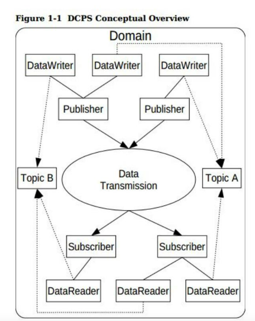
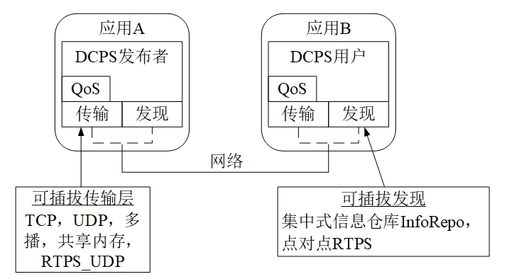

opendds 简介
==============

* :download:`opendds官方应用手册.pdf<res/OpenDDS-3.22.pdf>` 

DDS(DataDistributionService)是数据分发服务的首字母的缩略词

DDS采用发布/订阅体系架构，强调以数据为中心，提供丰富的QOS服务质量策略，能保障数据进行实时，高效，灵活的分发，可满足各种分布式
实时通信应用需求

DDS中以数据为中心的发布/订阅(DCPS)模型构建了一个共享的"全局数据空间"的概念，所有的数据对象都存在于此空间中，分布式节点通过简单的读，写操作便可以
访问这些数据对象．实际上，数据并非存在于所有计算机的地址空间中，它仅存在于那些对它感兴趣的应用程序的本地缓存中，而这一点正式发布/订阅模型的关键所在

DDS规范列举并定义了一整套全面的Qos(Quality of service, 服务质量)策略，能利用Qos进行系统控制

基本概念
-----------

下图显示了dds dcps层的概述

dds通信的基本要素
^^^^^^^^^^^^^^^^^^^

- 域(domain): 域是DCPS中基本分区单元，每个域中的实体只能与此域中的实体进行通信

- 域参与者(domainparticipant): 域参与者是应用程序的入口点，以方便在特定域中进行交互.域参与者是写入或读取数据多个对象的工厂

- 主题(topic): 主题是发布，订阅应用程序之间进行交互的根本手段，每个主题在域里面都有一个独特的名称以及它发布的一个具体数据类型．发送数据时，发布过程
  总是指定主题，订阅者通过主题请求数据．在DCPS模型中，使用者可以通过不同实例发布相同主题的数据样本

- 数据写入器(data writer): 发送数据的组件

- 数据读取器(data reader): 接受数据的组件

- 发布者(publisher): 发布者负责获取所发布的数据，并且把它分发到域中所有相关订阅者处

- 订阅者(subscriber): 订阅者从发布者处接受信息，并递送到任何与它相连的、相关的数据读取者上。

内置主题
^^^^^^^^^^^^

dds规范定义了许多主题，这些主题被嵌入到dds实现中，订阅这些嵌入式主题，使应用程序开发人员能访问正在被使用的域的状态，包括哪些主题被注册，
哪些DataReader, DataWriter被连接以及断开，以及各种实体的Qos设置．

QoS策略
^^^^^^^^^

dds规范定义了许多QoS策略，应用程序利用这些策略，指定他们对于服务质量QoS的要求．参与者指定：从服务中，需要什么行为．同时，服务也决定了如何实现
这些行为．这些策略可应用到DCPS的所有实体中(比如主题，DataWriter, DataReader, 发布者，订阅者，域参与者),但对于所有实体类型而言能，不是所有的策略均有效

通过使用请求-提供(Request-Offered, RxO)模式，可以把订阅者和发布者进行匹配．

Listener
^^^^^^^^^

DCPS层为每个实体定义了一个回调接口，便于应用程序可以侦听关与那个实体的某些状态改变或事件．例如：当不存在可以读取的可用数据时，就会通知datareader

条件
^^^^^^

条件(condition)和等待集(waitset)能够为listeners在dds中检测感兴趣的时间提供选择，一般模式为

- 应用程序创建一种特定的condition对象，比如状态条件，并附加到一个waitset上

- 应用程序在waitset上等待，直到一个或多个条件为true

- 应用程序在相应的实体对象上进行调用，以便于提取必要信息

- datareader接口也具有带有读取条件参数的操作

- 提供查询条件对象，以作为订阅内容配置文件实现的一部分

OpenDDS架构
-------------

OpenDDS实现是在OMG IDL PSM严格解释说明的基础上的

可扩展传输框架
^^^^^^^^^^^^^^^^

OpenDDS使用由DDS规范定义的IDL接口，以便于初始化以及控制服务使用．通过一个OpenDDS特有的传输框架，可以实现数据传输，而此框架可以允许服务利用各种传输协议，
因此可称为 ``可插拔的传输层`` ，使得OpenDDS的架构具有很大的灵活性. 目前OpenDDS支持TCP/UDP/IP多点发送/共享内存以及RTPS_UDP等多种传输协议.传输协议可以通过
配置文件指定

dds发现
^^^^^^^^

dds实现必须通过一些 ``集中式代理`` 或者 ``分布式策略`` 发现彼此，而opendds的一个重要特征：通过利用 ``DCPS信息仓库(DCPSInfoRepo)`` 或者 ``RTPS发现(Discovery)`` ,
但在datawriter和datareader之间采用不同的传输协议进行数据传输

- 信息仓库(InfoRepo): 集中式的存储库类型，其作为一个单独的进行运行，可以允许发布者和订阅者以集中式发现彼此

- RTPS发现: 一种对等的发现类型，使用RTPS协议通知可用性和本地信息

DCPSInfoRepo是OpenDDS执行的一种独立式服务，以便于实现集中式方法，它作为一个CORBA服务器进行实现．当用户请求一个关于主题的订阅时，DCPSInfoRepo就会定位主题，
通知发布者目前有新的订阅者．

