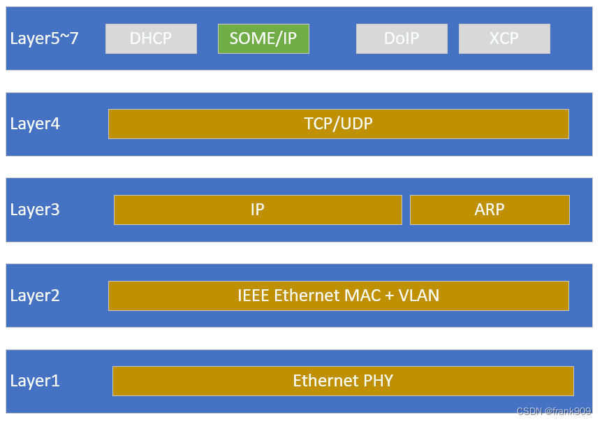
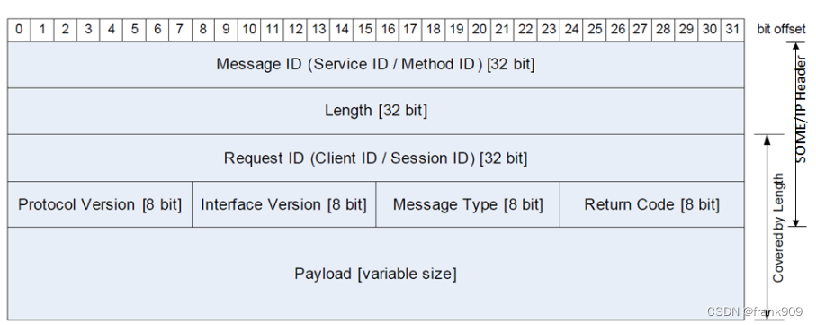
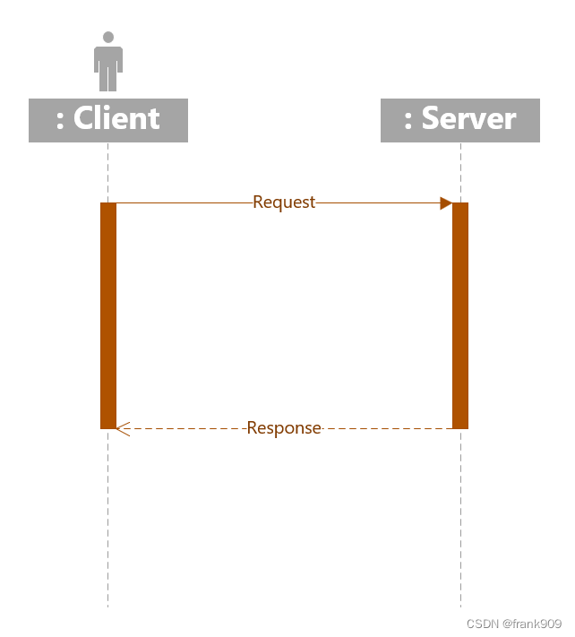
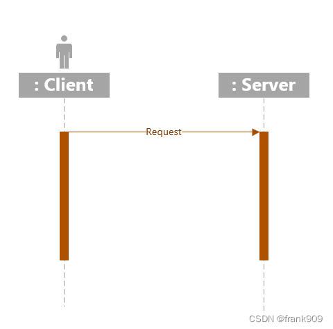
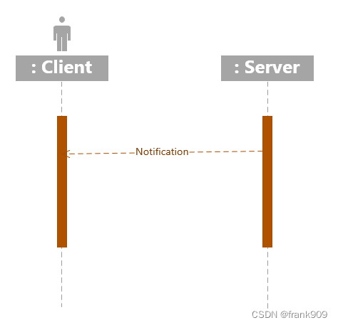

SOME/IP 简述
===============

* :download:`Autosar_SomeIP.pdf<res/AUTOSAR_PRS_SOMEIPProtocol.pdf>`

SOME/IP全称是Scalable service-Oriented MiddlewarE over IP,也就是IP协议的面向服务的可扩展性通信中间件协议．

SOME/IP支持提供以下服务:

- 服务发现(Service Discovery)
- 远程服务调用(RPC,remote producer call)
- 读写进程信息(Getter & Setter)

汽车协议开发中CAN是比较常见的一种协议，但CAN是 ``面向信号`` 的，而SOME/IP则是 ``面向服务`` 的．

SOME/IP 消息格式
------------------

SOME/IP协议一般指代SOME/IP, SOME/IP-SD, SOME/IP-TP 三种

- Message ID: Service ID或Method ID

Message ID可以指代一个远程调用RPC的Method或是一个服务的Event. Method ID和Event ID占据低15bit,中间1bit用来区别两者，高16bit代表service id

  
- Length: 消息长度，从Request ID算起
- Request ID
- Protocal Version: 协议版本号
- Interface Version: 接口版本号
- Message Type: 消息类型

=====================   =============================== ===============================================================================
 Type ID                    消息类型　                              解释
---------------------   ------------------------------- -------------------------------------------------------------------------------
 0x00                    REQUEST                         单纯的Request, 无Response
 0x01                    REQUEST_NO_RETURN               一个Fire&Forget类型的Request
 0x02                    NOTIFICATION                    一个关于Event的callback的request,无response
 0x80                    RESPONSE                        一个Response
 0x81                    ERROR                           一个带ERROR信息的Response
 0x20                    TP_REQUEST                      单纯的TP Request,无Request
 0x21                    TP_REQUEST_NO_RETURN            一个fire&forget类型的tp request
 0x22                    TP_NOTIFICATION                 一个关于Event的callback的TP request,无response
 0xa0                    TP_RESPONSE                     一个TP Response
 0xa1                    TP_ERROR                        一个带ERROR信息的tp request
=====================   =============================== ===============================================================================

- Return Code: 返回编码

根据messagetype不同，return code不同，一般是E_OK(0x00),但如果是Response或者是Error的话就不会是0x0

- Payload: 数据负载

SOME/IP底层可以基于TCP或者是UDP,UDP协议一般限制在1400Bytes, 但如果是TCP协议，通过数据分段传输可以实现更大容量的传输

通信模式
-----------

SOME/IP消息通信类型

- R&R(Request & Response)

最常见的通信模式就是请求/响应模式，客户端发送请求消息，服务器给予回应

- F&F(Fire & Forget)

客户端发送Request, 无需Response的操作称为Fire&Forget

- Notification

Notification代表的是一种Publish-Subscribe通信机制，Server端会主动推送信息给订阅方.Notification分三种情况

1. Cycle Update: 周期性的发送相关value的变化

2. Update On Change: 如果value发生变化，则往外推送

3. Epsilon Change: 如果value的值大于相应的epsilon的值，那么对外推送消息

- Event

