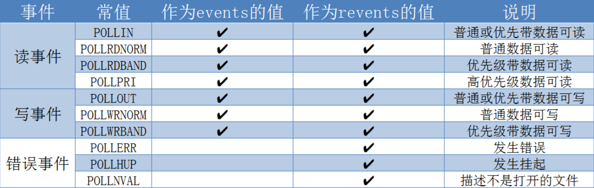

I/O复用之select/poll/epoll
==============================

概述
-------

I/O复用是用来解决进程或线程阻塞到某个I/O系统调用而出现的技术，使进程不阻塞于某个特定的I/O系统调用．

I/O复用使用的场合

- 当客户处理多个描述符(通常是交互式输入，网络套接字)时，必须使用I/O复用

- TCP服务器既要处理监听套接字，又要处理已连接的套接字，一般要使用I/O复用

- 如果一个服务器既要处理TCP又要处理UDP，一般要使用I/O复用

- 如果一个服务器要处理多个服务时，一般要使用I/O复用

select
---------

::

    #include <sys/select.h>
    #include <sys/time.h>
    #include <sys/types.h>

    /*
     * nfds: 指定要检测的描述符范围，所检测描述符最大值+1
     * readfds: 可读描述符集，监测该集合中的任意描述符是否有数据可读
     * writefds: 可写描述符集
     * exceptfds: 异常描述符集
     * timeout: 超时时间
     * return: 出错时返回-1,返回0时表示超时
    */
    int select(int nfds, fd_set *readfds, fd_set *write_fds,
                fd_set *exceptfds, struct timeval *timeout);

    //如果超时时间为NULL,则表示一直等待

    //该结构体表示超时等待时间
    struct timeval {
        long tv_sec; //秒
        long tv_usec; //微秒
    };

另外select需要配置集合操作函数

::

    //初始化描述符集
    void FD_ZERO(fd_set *fdset);

    //将一个描述符添加到描述符集
    void FD_SET(int fd, fd_set *fdset);

    //将一个描述符从描述符集中删除
    void FD_CLR(int fd, fd_set *fdset);

    //检测指定的描述符是否有事件发生
    int FD_ISSET(int fd, fd_set *fdset);

.. note::
    - 每次调用select,都需要把fd集合从用户态拷贝到内核态，这个开销在fd很多时会很大，同时每次调用select都需要在内核中遍历传递进来的所有fd
      文件描述符个数受限，单进程能够监控的文件描述符一般为1024,通过修改宏定义增大上限，单同样存在效率低的弱势
    - 性能衰减严重:IO随着监控的描述符数量增长，其性能会线性下降

poll
-------

select和poll系统调用的本质一样，管理多个描述符也是进行轮循，根据描述符的状态进行处理，但是poll没有最大文件描述符数量的限制(但是数量过大后性能也是会下降).
poll和select同样存在一个缺点就是，包含大量文件描述符的数组被整体复制于用户态和内核态的地址空间之间．

::

    #include <poll.h>
    
    /*
     * fds: 指定fd的条件
     * nfds: 用来指定第一个参数的数组元素个数
     * timeout: 指定等待的毫秒数
     * return: 失败时返回-1,超时返回0,成功则返回文件描述符个数
    */
    int poll(struct pollfd *fds, nfds_t nfds, int timeout);

    struct pollfd {
        int fd;         //文件描述符
        short events;   //监听的请求事件
        short revents;  //已发生的事件
    };

epoll
----------

epoll是在2.6版本内核中提出的，是select和poll的增强版．相对于select和poll来说，epoll更加灵活，没有描述符数量限制．epoll使用一个文件描述符管理多个描述符，
将用户空间的文件描述符的事件存放到内核的一个事件表中，这样在用户空间和内核空间的copy只需要一次．epoll机制是linux最高效的I/O复用机制

select/poll都只有一个方法，epoll操作过程有3个方法，分别是 ``epoll_create()`` , ``epoll_ctl()`` , ``epoll_wait()``

- epoll_create

::

    #include <sys/epoll.h>
    
    /* 用于创建epoll句柄，size是指监听的描述符个数，现在内核支持动态扩展，该值的意义仅仅是
     * 初次分配的fd个数，后面空间不够时会动态扩容．当创建完epoll句柄后，占用一个fd值
     * ls /proc/<pid>/fd/　可通过终端查看fd值
     * 使用完epoll后，必须调用close关闭，否则可能导致fd被耗尽
     */
    int epoll_create(int size);

- epoll_ctl

::

    #include <sys/epoll.h>

    /*
     * 功能: 用于对需要监听的文件描述符(fd)执行op操作，比如将fd加入到epoll句柄
     * epfd: epoll_create的返回值
     * op: 表示op操作，用三个宏来表示，EPOLL_CTL_ADD(添加), EPOLL_CTL_DEL(删除), EPOLL_CTL_MOD(修改)
     * fd: 需要监听的文件描述符
     * event: 需要监听的事件
     * return: 失败返回-1,超时返回0,正常则返回需要处理的事件数目
     */
    int epoll_ctl(int epfd, int op, struct epoll_event *event);

    struct epoll_event {
        __uint32_t events;  //epoll事件, EPOLLIN(可读，包括对端的SOCKET正常关闭), EPOLLOUT(可写)
                            //EPOLLERR(错误), EPOLLHUP(中断)，EPOLLPRI(高优先级的可读), EPOLLLET(将EPOLL设为边缘触发模式，这是相对水平触发来说的)
                            //EPOLLONESHOT(只监听一次事件，当监听完这次事件之后就不再监听该事件)
        epoll_data_t data;  //用户可用数据
    };

- epoll_wait

::

    #include <sys/epoll.h>

    /*
     * epfd: 等待epfd上的IO事件，最多返回maxevents个事件
     * events: 用来从内核得到事件的集合
     * maxevents: events数量，该maxevents值不能大于创建epoll_create的size
     * timeout: 超时时间(毫秒，0会立即返回)
     */
    int epoll_wait(int epfd, struct epoll_event *events, int maxevents, int timeout);
    

.. note::
    - 监视的描述符数量不受限制，所支持的fd上限是最大可以打开文件的数目，具体数目可以cat /proc/sys/fs/file-max来查看
    - IO性能不会随着监视fd的数量增长而下降，epoll不同于select和poll轮循的方式，而是通过每个fd定义的回调函数来实现的，只有据序的fd才会执行回调函数
