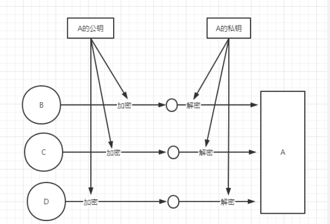
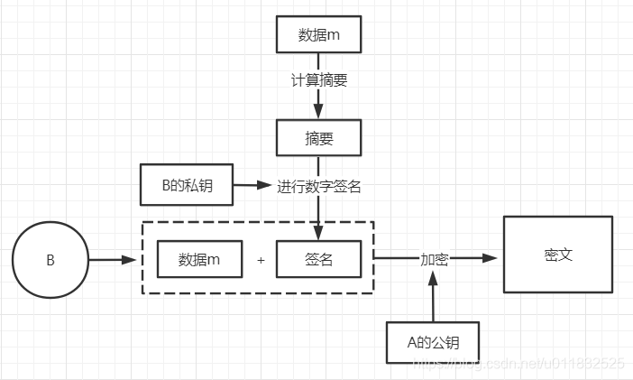
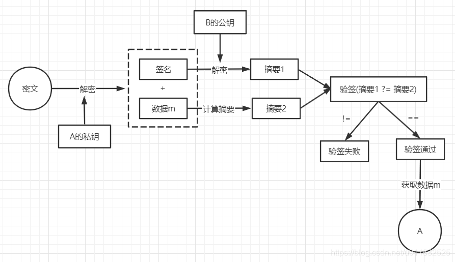

常用对称，非对称，摘要加密算法介绍
=========================================

常见的加密算法可以分成三类: 对称加密算法，非对称加密算法，Hash算法

对称加密算法
---------------

对称加密是使用同样一个密钥对信息进行加解密．

加密过程: 明文+密钥A, 进行加密，输出密文

解密过程: 密文+密钥A, 进行解密，输出明文

.. note::
    优点: 速度快，适合加密大量数据
    缺点: 密钥的传递存在着安全隐患，若在网络上传输，密钥泄漏，则消息内容泄漏
    常见算法: AES, DES, 3DES

非对称加密算法
----------------

与对称加密算法不同，非对称加密算法使用公钥和私钥管理这个过程．两者之间有数学相关，这种加密算法的原理就是对一极大整数做因数分解的困难性
来保证安全性．

从理论上讲，生成的公钥和私钥是对等的，只是两个数而已．把他们哪个公开出去用于加密，哪个保留起来用于解密，都是一样的．

常见的应用场景如下:

.. note::
    优点: 非对称加密与对称加密相比，其安全性更好
    缺点: 加密和解密花费时间场，速度慢，只适合对少量数据进行加密
    常见算法: RSA, ECC

上面的非对称加密实际上存在一个问题．公钥是公开的，任何人都可以获取，那就意味着，除了B, C, D以外的其他人，可以轻易拿到公钥．
那么此时如果有E, 拿到公钥后可以向A发布假消息．

所以，在非对称加密的基础上进行了改进，解决密文在传输过程中可能会被篡改的问题．那就是对消息内容进行 ``数字签名`` ,证明这个数据来源是B/C/D

数字签名过程如下

在进行数字签名时，常用的是 ``私钥签名，公钥验签``

验签过程如下

Hash加密算法(摘要算法)
------------------------

Hash算法特别的地方在于它是一种单向算法，用户可以通过hash算法对目标信息生成一段特定长度的唯一hash值，却不能通过这个hash值重新获得目标信息．
Hash算法是不可逆的，常用于信息完整性校验．比如常见的md5可以产生出一个128位(16字节)的散列值．

常见的Hash算法包括:MD2, MD5, SHA, SHA-1, HMAC, HMAC-MD5, HMAC-SHA1

