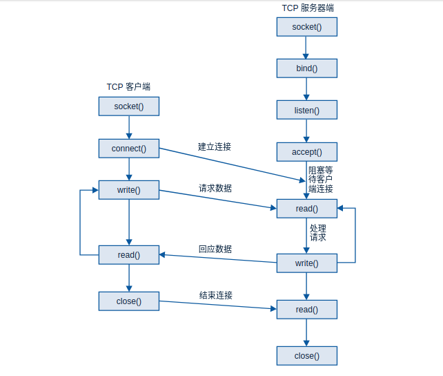

tcp socket
=============

socket tcp通信过程如下

TCP服务器
-----------

::

    #include <stdlib.h>
    #include <stdio.h>
    #include <unistd.h>
    #include <sys/types.h>
    #include <sys/socket.h>
    #include <sys/un.h>
    #include <string.h>
    #include <arpa/inet.h>

    int main(int argc, char *argv[]) 
    {
        int server_fd, client_fd;
        struct sockaddr_in server_addr;
        struct sockaddr_in client_addr;
        // 1. init server addr
        server_addr.sin_family = AF_INET;
        server_addr.sin_addr.s_addr = htonl(INADDR_ANY);
        server_addr.sin_port = htons(8888);
        int client_addr_len = sizeof(client_addr);
        // 2. create socket
        server_fd = socket(AF_INET, SOCK_STREAM, 0);
        // 3. bind server_addr to server_fd
        bind(server_fd, (struct sockaddr*)&server_addr, sizeof(server_addr));
        // 4. listen server_fd, max listen client num = 10
        listen(server_fd, 10);
        printf("TCP server is listening...\n");
        // 5. accept client connect
        char send_msg[] = "hello client";
        while(1) {
            client_fd = accept(server_fd, (struct sockaddr*)&client_addr, &client_addr_len);
            // 6. send data
            send(client_fd, send_msg, sizeof(send_msg), 0);
            printf("Write %s to client done...\n", send_msg);
            close(client_fd);
        }
        // 8. close server fd
        close(server_fd);
        return 0;
    }

TCP客户端
----------

::

    #include <stdlib.h>
    #include <stdio.h>
    #include <unistd.h>
    #include <sys/types.h>
    #include <sys/socket.h>
    #include <sys/un.h>
    #include <string.h>
    #include <arpa/inet.h>
    #inlcude <netinet/in.h>
    #include <netdb.h>

    int main(int argc, char *argv[])
    {
        if(argc < 2) {
            printf("Usage: ./tcp_client localhost\n");
            exit(1);
        }
        int server_fd = 0;
        // 1. init client addr
        struct sockaddr_in client_addr;
        client_addr.sin_family = AF_INET;
        struct hostent *myhost = gethostbyname(argv[1]);
        client_addr.sin_addr = (*((struct in_addr*)(myhost->h_addr)));
        client_addr.sin_port = htons(8888);
        // 2. create socket
        server_fd = socket(AF_INET, SOCK_STREAM, 0);
        // 3. connect server
        connect(server_fd, (struct sockaddr*)&client_addr, sizeof(client_addr));
        // 4. recv msg from server
        char msg_buf[100] = { 0 };
        recv(server_fd, msg_buf, 100, 0);
        printf("Client get server msg: %s\n", msg_buf);
        close(server_fd);
    }

