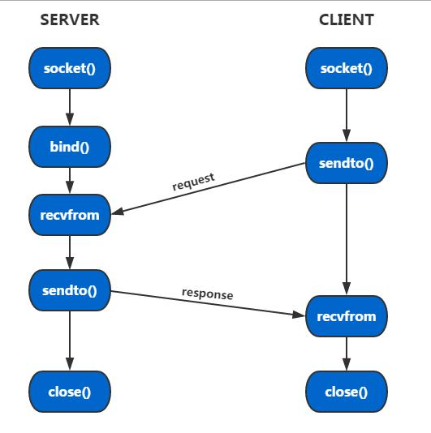

udp socket
=============

UDP(user datagram protocal)，中文名称为用户数据报协议，属于传输层．UDP是面向非连接的协议，它不与对方建立连接，而是直接把
要发的数据包发给对方．所以UDP适合用于一次传输的数据量很少，对可靠性要求不高，对实时性要求高的应用场景．UDP不像TCP需要建立
三次握手的连接，因而使得通信效率很高．

udp socket通信流程如下所示

.. note::
    客户端要发起一次请求仅需要两个步骤(socket和sendto),而服务端也仅仅需要三个步骤即可接收到客户端的消息(socket,bind,recvfrom)

通信实例
-----------

- server

::

    #include <stdio.h>
    #include <sys/types.h>
    #include <sys/socket.h>
    #include <netinet/in.h>
    #include <string.h>

    #define SERVER_PORT 8888
    #define BUFF_LEN 1024

    void handle_udp_msg(int fd)
    {
        char buf[BUFF_LEN];  //接收缓冲区，1024字节
        socklen_t len;
        int count;
        struct sockaddr_in clent_addr;  //clent_addr用于记录发送方的地址信息
        while(1)
        {
            memset(buf, 0, BUFF_LEN);
            len = sizeof(clent_addr);
            count = recvfrom(fd, buf, BUFF_LEN, 0, (struct sockaddr*)&clent_addr, &len);  //recvfrom是拥塞函数，没有数据就一直拥塞
            if(count == -1)
            {
                printf("recieve data fail!\n");
                return;
            }
            printf("client:%s\n",buf);  //打印client发过来的信息
            memset(buf, 0, BUFF_LEN);
            sprintf(buf, "I have recieved %d bytes data!\n", count);  //回复client
            printf("server:%s\n",buf);  //打印自己发送的信息给
            sendto(fd, buf, BUFF_LEN, 0, (struct sockaddr*)&clent_addr, len);  //发送信息给client，注意使用了clent_addr结构体指针

        }
    }

    /*
        server:
                socket-->bind-->recvfrom-->sendto-->close
    */

    int main(int argc, char* argv[])
    {
        int server_fd, ret;
        struct sockaddr_in ser_addr;

        server_fd = socket(AF_INET, SOCK_DGRAM, 0); //AF_INET:IPV4;SOCK_DGRAM:UDP
        if(server_fd < 0)
        {
            printf("create socket fail!\n");
            return -1;
        }

        memset(&ser_addr, 0, sizeof(ser_addr));
        ser_addr.sin_family = AF_INET;
        ser_addr.sin_addr.s_addr = htonl(INADDR_ANY); //IP地址，需要进行网络序转换，INADDR_ANY：本地地址
        ser_addr.sin_port = htons(SERVER_PORT);  //端口号，需要网络序转换

        ret = bind(server_fd, (struct sockaddr*)&ser_addr, sizeof(ser_addr));
        if(ret < 0)
        {
            printf("socket bind fail!\n");
            return -1;
        }

        handle_udp_msg(server_fd);   //处理接收到的数据

        close(server_fd);
        return 0;
    }

- client

::

    #include <stdio.h>
    #include <sys/types.h>
    #include <sys/socket.h>
    #include <netinet/in.h>
    #include <string.h>

    #define SERVER_PORT 8888
    #define BUFF_LEN 512
    #define SERVER_IP "172.0.5.182"

    void udp_msg_sender(int fd, struct sockaddr* dst)
    {

        socklen_t len;
        struct sockaddr_in src;
        while(1)
        {
            char buf[BUFF_LEN] = "TEST UDP MSG!\n";
            len = sizeof(*dst);
            printf("client:%s\n",buf);  //打印自己发送的信息
            sendto(fd, buf, BUFF_LEN, 0, dst, len);
            memset(buf, 0, BUFF_LEN);
            recvfrom(fd, buf, BUFF_LEN, 0, (struct sockaddr*)&src, &len);  //接收来自server的信息
            printf("server:%s\n",buf);
            sleep(1);  //一秒发送一次消息
        }
    }

    /*
        client:
                socket-->sendto-->revcfrom-->close
    */

    int main(int argc, char* argv[])
    {
        int client_fd;
        struct sockaddr_in ser_addr;

        client_fd = socket(AF_INET, SOCK_DGRAM, 0);
        if(client_fd < 0)
        {
            printf("create socket fail!\n");
            return -1;
        }

        memset(&ser_addr, 0, sizeof(ser_addr));
        ser_addr.sin_family = AF_INET;
        //ser_addr.sin_addr.s_addr = inet_addr(SERVER_IP);
        ser_addr.sin_addr.s_addr = htonl(INADDR_ANY);  //注意网络序转换
        ser_addr.sin_port = htons(SERVER_PORT);  //注意网络序转换

        udp_msg_sender(client_fd, (struct sockaddr*)&ser_addr);

        close(client_fd);

        return 0;
    }

