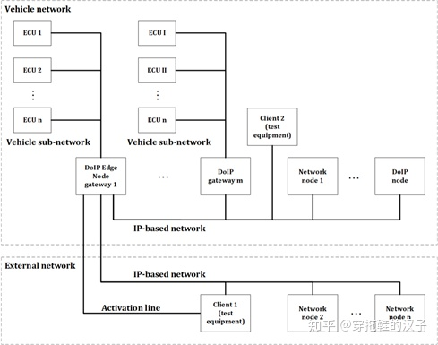
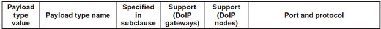

DoIP协议框架
===============

DoIP协议(Diagnostic On IP---ISO 13400)定义将IP技术应用到车载网络诊断范畴的通信规则．其中包含两层含义:

- 将IP技术应用到车载网络中，需满足车规需求

- 在诊断范畴，DoIP协议定义了从物理层(Physical Layer)到应用层(Application Layer)搭建"通信桥梁"的规则(此处可类似
  CAN总线的TP层协议ISO 15765-2)

将上述概念映射到OSI计算机7层模型:

DoIP所在的位置位于七层模型中第三层和第四层．如图所示，其中运用到的IP协议，TCP/IP协议，UDP协议．整个ISO 13400-2协议中定义的内容
是规定了搭建"通信渠道"(Tester与ECU之间的通信渠道)的规则．TLS是2020版DoIP协议新增的内容，主要目的是为了保证通信数据的安全性．

DoIP通信过程
----------------

下面会对整个"通信桥梁"的搭建过程做一个概述性的描述，具体步骤如下

1) 物理连接(Physically connection)

2) 车辆申明(Vehicle Discovery)

3) 通信建立(Connection Establishment)

4) 诊断通信(Diagnostic Communication)

物理连接
^^^^^^^^^^

首先从功能视角来看车内网络与车身外网络

车外客户端(Test equipment)用相应的接口卡(IP-Based Network)连接车身边缘节点(DoIP Edge Node WG).在ISO 13400协议中规定外部诊断设备连接边缘节点，
且需要用激活线来激活边缘节点的DoIP功能

物理连接后，通过相应手段获取IP地址，建立通信．

车辆声明
^^^^^^^^^^^

物理连接后，车辆会以广播的形式发送三次车辆声明，声明的信息可以包含:

1) VIN

2) EID

3) GID

如果诊断设备没有获取车辆信息，也可以主动请求(Vehicle Identification request)来获取相应信息(如上图所示)

建立通信
^^^^^^^^^^^^^

在DoIP协议中，有Socket概念: Socket一端连接着IP地址，一端连接着Port端口．并且Socket对于芯片而言是一种资源．因此有激活失效之分

在协议中定义了Payload Type(0005/0006)用于激活Socket

激活后，Socket使能，接下来就可以进行诊断通信

诊断通信
^^^^^^^^^^^

Socket激活后，可以进行诊断通信，通信模型如下图所示

外部Tester发送诊断请求，网关收到诊断请求后，会给予一个收到答复(Acknowledgement),用意是告诉Tester,网关此时已收到诊断请求，与此同时网关
将诊断请求(Diagnostic Request)发送至Target ECU. ECU收到诊断请求，并基于这个请求给予响应

因此对于Tester而言，一共收到两个响应

1) Diagnostic Message Acknowledgement

2) Diagnostic Message Response

每一帧响应对应的帧类型不同

DoIP协议
------------

在数据链路层和物理层，根据IS0-13400的要求，DoIP通信在物理层支持100BASE-TX和10BASE-TX两种制式

在传输层，DoIP通信必须同时支持UDP和TCP，并对UDP和TCP的使用场合进行了定义，对所使用的端口号也进行了定义

在网络层上DoIP使用IPV6协议，但为了向后兼容的原因，也支持IPV4,对于IPV4还要支持地址解析协议(ARP),对于IPV6还要支持邻居发现协议(NDP)，
这两个协议都是用于在只知道IP地址的情况下获取MAC地址的．

DoIP数据帧格式
^^^^^^^^^^^^^^^^

**以太网帧**

**IP段**

**TCP段**

**UDP段**

**DoIP段**

==============  =================================================================
 协议版本值　           解释
--------------  -----------------------------------------------------------------
 0x00               reserved
 0x01               DoIP ISO/DIS 13400-2:2010
 0x02               DoIP ISO 13400-2:2012
 0x03..0xFE         reserved by this part of ISO 13400
 0xFF               default value for vehicle identifcation request messages 
==============  =================================================================

DoIP datatype

- 0x0001至0x0004 用于汽车标识上报或请求，只能通过UDP报文来发送这种命令，主要用于汽车和诊断仪进入网络之后，诊断连接建立
  之前的车辆发现过程．

- 0x0005和0x0006标识的Routing activation request和response用于在socket建立之后，进行诊断通信的请求

- 0x0007和0x0008用于Alive check,用于检查当前建立的诊断连接socket是否仍然在使用中，如果不再使用，则关闭socket释放资源

- 0x8001, 0x8002, 0x8003,分别代表的含义是诊断消息，诊断正响应和诊断负响应

连接状态
^^^^^^^^^^

DoIP实体内管理着一个DoIP connection table,用来记录和维护诊断通信的逻辑连接．

- [Step1] 当一个新的套接字建立，逻辑连接的状态就从"listen"跳转到"socket initialized",同时启动一个定时器，initial inactivity timer

- [Step2] 当DoIP实体接收到tester发来的一个routing activation信息后，逻辑连接的状态从"socket initialized"跳转到"Registered[Pending for Authentication]",
  此时initial inactivity timer被停止，启动general inactivity timer的定时器

- [Step3] 在完成Authentication之后，逻辑连接的状态就从"Registered[Pending for Authentication]"跳转到"Registered[Pending for Confrmation]"

- [Step4] 在完成Confrmation之后，逻辑连接的状态就从"Registered[Pending for Confrmation]"跳转到"Registered[Routing Active]"

- [Step5] 如果initial timer或general inactivity timer过期后仍没有收到后续请求，或者authentication和confrmation被拒绝了，又或者外部测试设备对alive check消息没有响应，则逻辑
  进入"Finalize"状态

- [Step6] 进入Finalize后，此时TCP套接字将被关闭，并重新回到"listen"状态

示例
------

以下为请求DID F810读取的DoIP报文

==================  =====================================================================
 字段　                     描述
------------------  ---------------------------------------------------------------------
 byte 0                 ISO 13400版本
 byte1                  ISO 13400版本逐比特取反
 byte2-3                数据类型，0x8001,表明这是一个诊断信息的数据包
 byte4-7                数据长度，在这个例子中值为7，表示后面有7个字节的数据
 byte8-9                源地址
 byte10-11              目的地址
 byte12-13              具体的诊断命令，SID是22，表示读取，DID是0xF810
==================  =====================================================================

