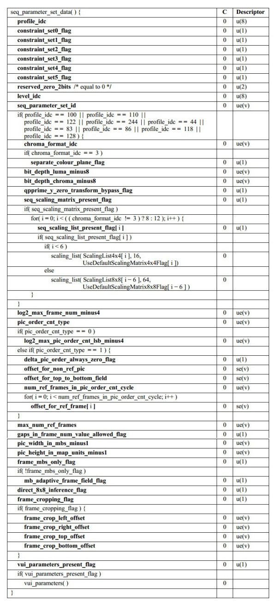
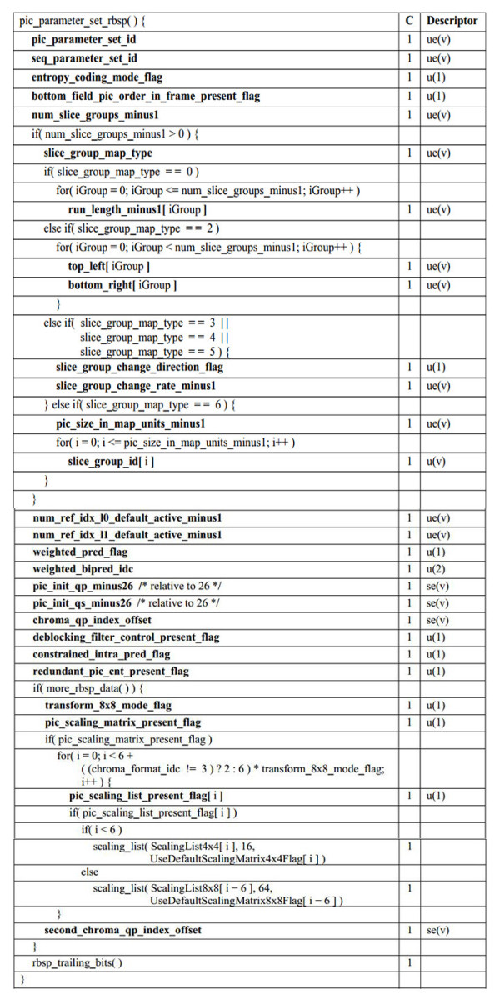

H264结构
==========

H.264原始码流是由一个个的NALU组成，它的功能分为两层， ``VCL(视频编码层)`` 和 ``NAL(网络提取层)``

::

    ---------------+-----------------------------------------------------------------------------
    |   H.264      |    VAL(Video Coding Layer) + NAL(Network Abstraction Layer)                |
    ---------------+-----------------------------------------------------------------------------

- VCL: 进行视频编解码，包括预测(帧内预测和帧间预测)，DCT变化和量化，墒编码和切分数据等功能，是为了实现更高的视频压缩比

- NAL: 负责以网络所要求的恰当方式对VCL数据进行打包和传送

VCL是管理h264的视频数据层，是为了实现更高的视频压缩比，抛开H264压缩算法细节来看就3步

1. 压缩: 预测(帧内预测和帧间预测)----->DCT变化和量化--------->比特流编码

2. 切分数据

3. 压缩切分后的VCL数据会包装成为NAL的一部分

网络提取层(NAL)
-------------------

NAL(Network Abstraction Layer),这块和H264的压缩算法无关，设计NAL的目的就是为了实现良好的网络亲和性，即适用于各种传输网络

NAL的组成单元是NALU

- header: 一般存储标志信息，比如NALU的类型．NAL会打包VCL数据，但这并不意味着所有的NALU负载都是VCL

- payload: 存储了真正的数据

NALU Header
^^^^^^^^^^^^

NALU只占一个字节，即8位

.. image::
    res/nalu_header.jpg

- forbidden_zero_bit: 在网络传输中发生错误时，会被置为1,告诉接收方丢弃该单元

- nal_ref_idc: 用于表示当前NALU的重要性，值越大，越重要

- nal_unit_type: 表示NALU的数据类型

=================   ===========================================
 Nal_unit_type                  NAL
-----------------   -------------------------------------------
        0               未使用
        1               不区分，非IDR图像的片
        2               编码slice数据划分A(一般不会用到)
        3               编码slice数据划分B(一般不会用到)
        4               编码slice数据划分C(一般不会用到)
        5               IDR图像中的片
        6               补充增强信息单元(SEI)
        7               序列参数集(SPS)
        8               图像参数集(PPS)
        9               分界符
        10              序列结束
        11              码流结束
        12              填充
        13~23           保留
        24~31           未使用
=================   ===========================================

SPS语法元素及其含义
^^^^^^^^^^^^^^^^^^^^

SPS中的信息至关重要，如果其中的数据丢失或出现错误，那么解码过程可能会导致失败．

SPS(Sequence Paramater Set),称为序列参数集，SPS中保存了一组编码视频序列的全局参数．所谓的编码视频序列即原始视频的一帧一帧
的像素数据经过编码之后的结构组成的序列．一般情况下SPS和PPS的NALU单元通常位于整个码流的起始位置，但网络直播中一般每个I帧前面会带SPS和PPS信息

- profile_idc: 标识当前码流的profile: 基准档次(baseline profile), 主要档次(main profile), 扩展档次(extended profile)

- level_idc: 当前码流的level. 编码的level定义了某种条件下的最大视频分辨率，最大视频帧率等参数

- seq_parameter_set_id: 表示当前序列参数集的id,通过该id值，图像参数集pps可以引用其代表的sps中的参数

- log2_max_frame_num_minus4: 用于计算MaxFrameNum的值．计算公式为MaxFrameNum=2^(log2_max_frame_num_minus4 + 4). MaxFrameNum是frame_num的上限值，frame_num是
  图像序号的一种表示方法，在帧间编码中常作为一种参考帧标记的手段

- pic_order_cnt_type: 表示解码picture order count(POC)的方法，POC是另一种计量图像序号的方式，与frame_num有着不同的计算方法．该语法元素的取值为0, 1, 2

- log2_max_oic_order_cnt_lsb_minus4: 用于计算MaxPicOrderCntLsb的值，该值表示POC的上限．计算方法为MaxPicOrderCntLsb=2^(log2_max_pic_order_cnt_lsb_minus4 + 4)

- max_num_ref_frames: 用于表示参考帧的最大数目

- gaps_in_frame_num_value_allowed_flag: 标识位，说明frame_num中是否允许不连续的值

- pic_width_in_mbs_minus1: 用于计算图像的宽度，单位为宏块的个数，图像实际宽度为: frame_width = 16 * (pic_width_in_mbs_minus1 + 1)

- pic_height_in_map_units_minus1: 使用PicHeightInMapUnit来度量视频中一帧图像的高度

- frame_mbs_only_flag: 说明宏块的编码方式，0时宏块可能为帧编码或场编码，1时所有宏块采用帧编码 

- mb_adaptive_frame_field_flag: 标识位，说明是否采用宏块级的帧场自适应编码,该标识位为0时，不存在帧编码和场编码之间的切换．为1时，宏块可能在帧编码
  和场编码之间进行选择

- direct_8x8_inference_flag: 标识位，用于B_Skip, B_Direct模式运动矢量的推导计算

- frame_cropping_flag: 标识位，说明是否需要对图像帧进行裁剪

- vui_parameters_present_flag: 标识位，说明SPS中是否存在VUI信息

PPS语法元素及其含义
^^^^^^^^^^^^^^^^^^^^^

封装格式中，PPS通常与SPS一起保存在视频文件的文件头中

- pic_parameter_set_id:

