MP4文件格式
=============

* :download:`mp4标准.pdf<res/ISO_IEC_14496-12_2015.pdf.pdf>` 

多媒体封装格式(也叫容器格式),是指按照一定的规则，将视频数据音频数据等放到一个文件中．常见的MKV,AVI,MP4都是封装格式．

MP4文件由多个box组成，每个box存储不同的信息，且box之间是树状结构

box
------

box类型有很多，下面是3种比较重要的顶层box:

- ftyp: File Type Box, 描述文件遵从的MP4规范与版本

- moov: Movie Box,　媒体的metadata信息，有且仅有一个

- mdat: Media Data Box, 存放实际的媒体数据,一般有多个

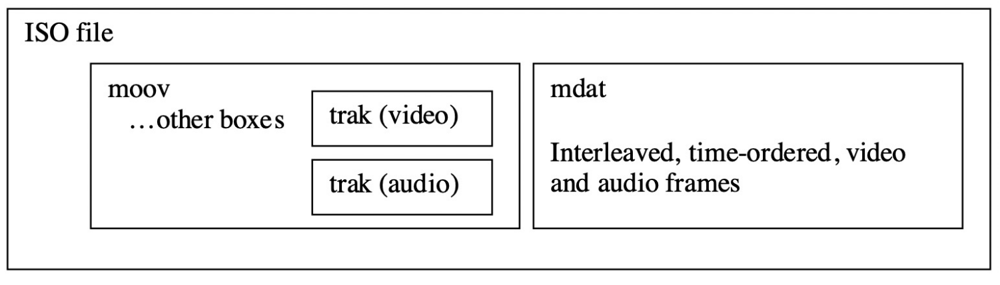

下面是常见的box

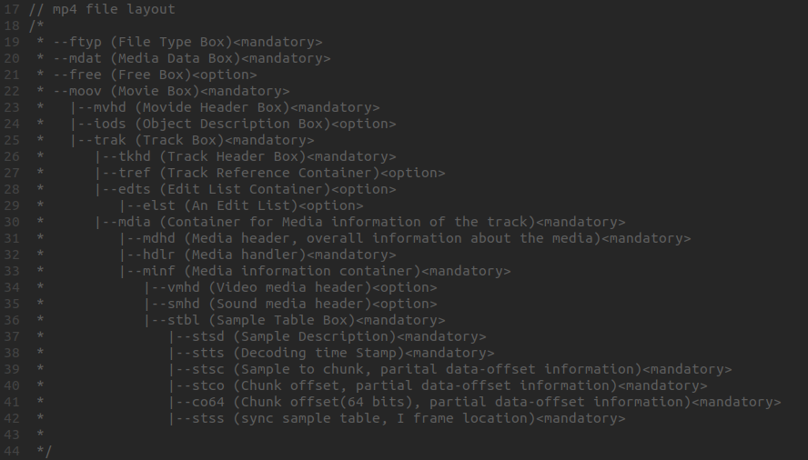

1个box由两部分组成，box header, box body

1. box header: box的元数据，比如box type, box size

2. box body: box的数据部分，实际存储的内容跟box类型有关，比如mdat中body部分存储的媒体数据

.. note::
    box header中，只有type, size是必选字段．当size==0,存在largesize字段，在部分box中，还存在version,flags字段，这样的box叫full box.
    当box body中嵌套其他box时，这样的box叫container box

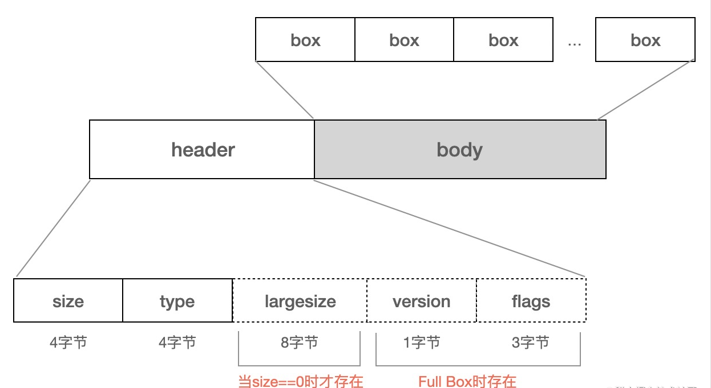

Box Header
^^^^^^^^^^^^^

字段定义如下

- type: box类型，包括预定义类型，自定义扩展类型，占4个字节

  - 预定义类型: 比如ftyp, moov, mdat等预定义好的类型

  - 自定义扩展类型: 如果ttype == uuid,则表示自定义类型，size(或largesize)随后的16字节，为自定义的值

- size: 包含box header在内的整个box的大小，单位是字节，当size为0或1时，需要特殊处理

  - size等于0: box的大小由后续的largesize确定(一般只有装载媒体数据的mdat box需要largesize)

  - size等于1: 当前box为文件的最后一个box,通常包含在mdat box中

- largesize: box的大小，占8个字节

- extended_type: 自定义扩展类型，占16个字节

- version: 当前box的版本，为扩展做准备，占1个字节

- flags: 标志位，占24位，具体含义由具体的box自己定义

box的伪代码:

::

    aligned(8) class Box (unsigned int(32) boxtype, optional unsigned int(8)[16] extended_type) {
        unsigned int(32) size;
        unsigned int(32) type = boxtype;
        if (size==1) {
            unsigned int(64) largesize;
        } else if (size==0) {
            // box extends to end of file
        }
        if (boxtype==‘uuid’) {
            unsigned int(8)[16] usertype = extended_type;
        } 
    }

Box Body
^^^^^^^^^

box数据体，不同box包含的内容不同，需要参考具体box的定义

ftyp (File Type Box)
---------------------

ftyp用来指出当前文件遵循的规范，ftyp的伪代码如下

::

    aligned(8) class FileTypeBox extends Box(‘ftyp’) {
      unsigned int(32) major_brand;
      unsigned int(32) minor_version;
      unsigned int(32) compatible_brands[]; // to end of the box
    }

- major_brand: 比如常见的isom, mp41, avc1等．它表示最好基于哪种格式来解析当前的文件，如果major_brand是A, compatible_brands是A1,当解码器同时支持A,A1规范时最好使用A规范来解码当前媒体文件

- minor_version: 提供major_brand的说明信息，比如版本号

- compatible_brands: 文件兼容的brand列表

常见的几种brand如下

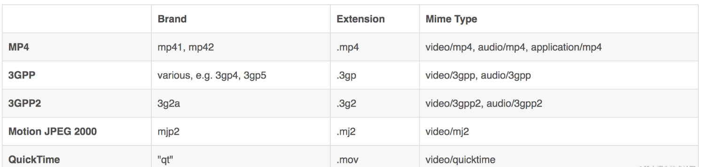

实例如下

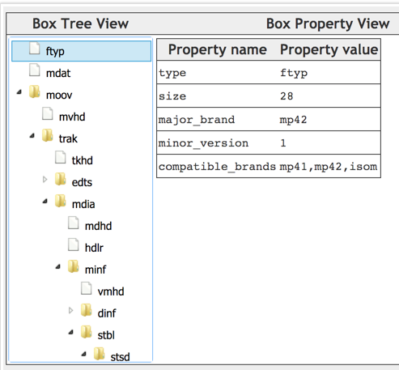

moov (Movie Box)
----------------------

Movie Box,存储mp4的metadata,一般位于mp4文件的开头

moov中最重要的两个box是mvhd和trak:

- mvhd: Movie Header Box, mp4文件的整理信息，如果创建时间，文件时长等

- trak: Track Box, 一个mp4可以包含一个或多个轨道(比如视频轨道，音频轨道),轨道相关的信息就在trak中．trak是container box, 至少包含两个box(tkhd, media)

.. note::
    mvhd针对整个影片，tkhd针对单个track, mdhd针对媒体，vmhd针对视频，smhd针对音频

mvhd (Movie Header Box)
^^^^^^^^^^^^^^^^^^^^^^^^^^

MP4文件的整体信息，跟具体的视频流，音频流无关，比如创建时间，文件时长等

伪代码如下

::

    aligned(8) class MovieHeaderBox extends FullBox(‘mvhd’, version, 0) { if (version==1) {
          unsigned int(64)  creation_time;      //创建时间
          unsigned int(64)  modification_time;  //文件修改时间
          unsigned int(32)  timescale;          //一秒包含的时间单位
          unsigned int(64)  duration;           //影片时长,根据文件中track的信息推导出来，等于时间最
                                            //长的track的duration
       } else { // version==0
          unsigned int(32)  creation_time;
          unsigned int(32)  modification_time;
          unsigned int(32)  timescale;
          unsigned int(32)  duration;
    }
    //推荐的播放速率，高低16位分别代码整数和小数部分
    template int(32) rate = 0x00010000; // typically 1.0
    //播放音量，高低8位分别代表整数小数部分，1.0为最大值
    template int(16) volume = 0x0100; // typically, full volume const bit(16) reserved = 0
    const unsigned int(32)[2] reserved = 0;
    //视频的转换矩阵，一般忽略不计
    template int(32)[9] matrix =
    { 0x00010000,0,0,0,0x00010000,0,0,0,0x40000000 };
          // Unity matrix
       bit(32)[6]  pre_defined = 0;
       //必须为非0值，当添加一个新的track id,必须比已经使用的track id要大
       unsigned int(32)  next_track_ID;
    }

tkhd (Track Box)
^^^^^^^^^^^^^^^^^^

单个track的metadata，伪代码如下

::

    aligned(8) class TrackHeaderBox 
      extends FullBox(‘tkhd’, version, flags){ 
      //flags: 按位或操作获得，默认值是7(0x000001 | 0x000002 | 0x000004)
      //0x0000001:表示这个track是启用的，如果为0则表示这个track没有启用
      //0x0000002:表示当前track在播放时会用到
    　//0x0000004:表示当前track用于预览模式
        if (version==1) {
              unsigned int(64)  creation_time;  //当前track创建时间
              unsigned int(64)  modification_time;　//当前track的最近修改时间
              unsigned int(32)  track_ID; //当前track的唯一标识，不能为0,不能重复
              const unsigned int(32)  reserved = 0;
              unsigned int(64)  duration; //当前track的完整时长(需要除以timescale得到具体秒数)
           } else { // version==0
              unsigned int(32)  creation_time;
              unsigned int(32)  modification_time;
              unsigned int(32)  track_ID;
              const unsigned int(32)  reserved = 0;
              unsigned int(32)  duration;
        }
        const unsigned int(32)[2] reserved = 0;
        template int(16) layer = 0;     //视频轨道的叠加顺序，数字越小越靠近观看者
        template int(16) alternate_group = 0; //track的分组id,同一个分组里的track只能有一个处于播放状态
        //音量值，介于0.0~1.0之间
        template int(16) volume = {if track_is_audio 0x0100 else 0}; 
        const unsigned int(16) reserved = 0;
        template int(32)[9] matrix= { 0x00010000,0,0,0,0x00010000,0,0,0,0x40000000 }; // unity matrix
        //视频的宽高
        unsigned int(32) width;
        unsigned int(32) height;
    }

实例如下:

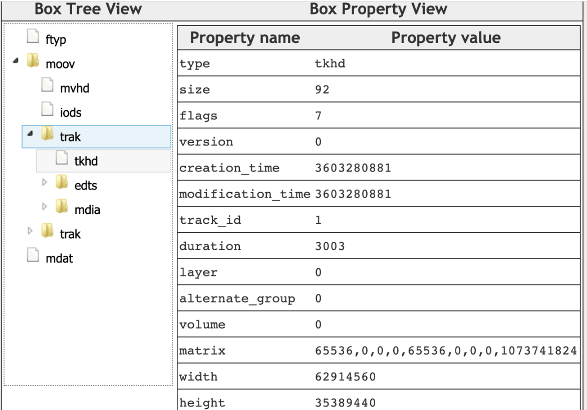

hdlr (Handler Reference Box)
^^^^^^^^^^^^^^^^^^^^^^^^^^^^^^^

hdlr申明当前track的类型，以及对应的处理器(handler)

handler_type的取值包括

- vide（0x76 69 64 65），video track；

- soun（0x73 6f 75 6e），audio track；

- hint（0x68 69 6e 74），hint track；

伪代码如下:

::

    aligned(8) class HandlerBox extends FullBox(‘hdlr’, version = 0, 0) {
        unsigned int(32) pre_defined = 0;
        unsigned int(32) handler_type;
        const unsigned int(32)[3] reserved = 0;
        string   name;  //utf8字符串，对handler进行描述
    }

实例如下

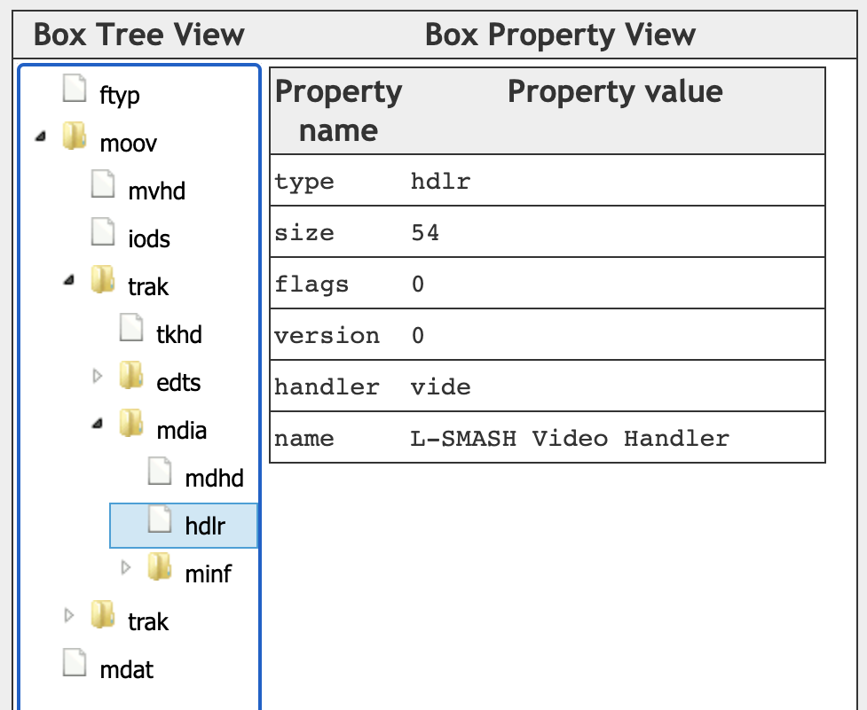

stbl (Sample Table Box)
^^^^^^^^^^^^^^^^^^^^^^^^

mp4文件的媒体数据在mdat box里，而stbl则包含了这些媒体数据的索引及时间信息．在mp4文件中，媒体数据被分成多个chunk,每个chunk可包含多个sample,而sample则由帧组成(通常一个
sample对应1帧)

stbl中比较关键的box包含stsd,stco,stsc,stsz,stss,ctts

- stsd: 给出视频，音频的编码，宽高，音量等信息，以及每个sample中包含多少个frame

- stco:　chunk在文件中的偏移

- stsc: 每个chunk中包含几个sample

- stsz: 每个sample的size(单位是字节)

- stts: 每个sample的时长

- stss: 哪些sample是关键帧

- ctts: 帧解码到渲染的时间差值，通常用在B帧的场景

**stsd(Sample Description Box)**

stsd给出sample的描述信息，这里面包含了在解码阶段需要用到的任意初始化信息，对于视频，音频来说所需的初始化信息不同,以下为视频部分的伪代码

::

    aligned(8) abstract class SampleEntry (unsigned int(32) format) extends Box(format){
        const unsigned int(8)[6] reserved = 0;
        unsigned int(16) data_reference_index;  
        //当mp4文件的数据部分被分割成多个片段，每个片段对应一个索引
    }

    // Visual Sequences
    class VisualSampleEntry(codingname) extends SampleEntry (codingname){
        unsigned int(16) pre_defined = 0;
        const unsigned int(16) reserved = 0;
        unsigned int(32)[3] pre_defined = 0;
        //视频宽高
        unsigned int(16) width;
        unsigned int(16) height;
        //水平，垂直方向的分辨率
        template unsigned int(32) horizresolution = 0x00480000; // 72 dpi
        template unsigned int(32) vertresolution = 0x00480000; // 72 dpi
        const unsigned int(32) reserved = 0;
        //一个sample中包含多少个frame,对于video track来说，默认是1
        template unsigned int(16) frame_count = 1;
        //仅供参考的名字，通常用于展示，占32个字节，比如 AVC Coding
        string[32] compressorname;
        //位图的深度信息，如果0x0018(24)
        template unsigned int(16) depth = 0x0018;
        int(16) pre_defined = -1;
    }

    // AudioSampleEntry、HintSampleEntry 定义略过

    aligned(8) class SampleDescriptionBox (unsigned int(32) handler_type) extends FullBox('stsd', 0, 0){
        int i ;
        unsigned int(32) entry_count;
        for (i = 1 ; i u entry_count ; i++) {
              switch (handler_type){
                case ‘soun’: // for audio tracks
                    AudioSampleEntry();
                    break;
                case ‘vide’: // for video tracks
                   VisualSampleEntry();
                   break;
                case ‘hint’: // Hint track
                   HintSampleEntry();
                   break;
            }
        }
    }

实例如下

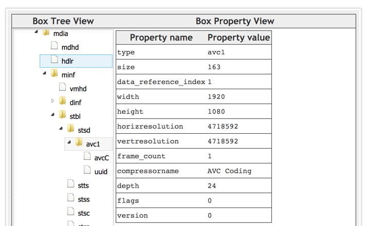

**stco(Chunk Offset Box)**

chunk在文件中的偏移量，针对小文件，大文件，有两种不同的box类型，分别是stco,co64，他们的结构是一样的，只是字段长度不同

chunk_offset指的是在文件本身中的offset,而不是某个box的内部偏移.在构建mp4文件的时候，需要特别注意moov所处的位置，它对于chunk_offset的值是有影响的

stco的伪代码如下

::

    # Box Type: ‘stco’, ‘co64’
    # Container: Sample Table Box (‘stbl’) Mandatory: Yes
    # Quantity: Exactly one variant must be present

    aligned(8) class ChunkOffsetBox
        extends FullBox(‘stco’, version = 0, 0) {
        unsigned int(32) entry_count;
        for (i=1; i u entry_count; i++) {
            unsigned int(32)  chunk_offset;
        }
    }

    aligned(8) class ChunkLargeOffsetBox
        extends FullBox(‘co64’, version = 0, 0) {
        unsigned int(32) entry_count;
        for (i=1; i u entry_count; i++) {
            unsigned int(64)  chunk_offset;
        }
    }

实例如下

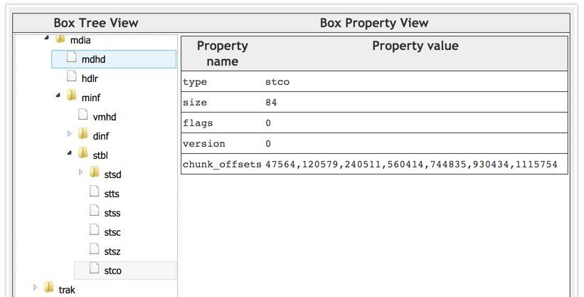

**stsc(Sample To Chunk Box)**

sample以chunk为单位分成多个组，chunk的size可以是不同的，chunk里面的sample的size也可以是不同的

::

    aligned(8) class SampleToChunkBox
        extends FullBox(‘stsc’, version = 0, 0) {
        unsigned int(32) entry_count; //有多少个表项
        for (i=1; i u entry_count; i++) {
            unsigned int(32) first_chunk;   //当前表项中对应的第一个chunk的序号
            unsigned int(32) samples_per_chunk; //每个chunk包含的sample数
            unsigned int(32) sample_description_index; //指向stsd中的sample description的索引值
        }
    }

实例

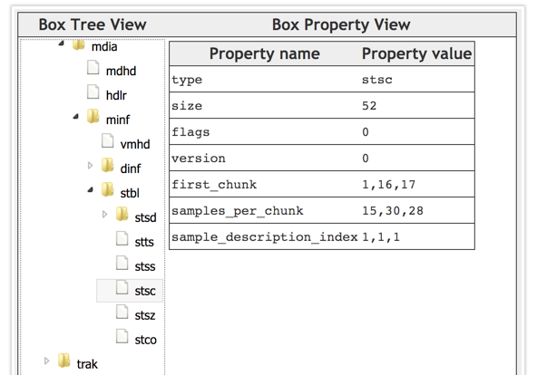

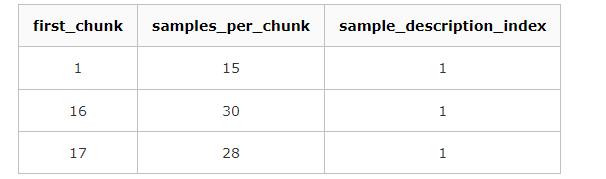

1.需要1~15的chunk,每个chunk包含15个sample

2.需要为16的chunk,包含30个sample

3.需要为17及以后的chunk,每个chunk包含28个sample

4.以上所有chunk中的sample,对应的sample description的索引都是1

**stsz(Sample Size Boxes)**

每个sample的大小，根据sample_size的字段可以知道当前track包含了多少个sample(或帧), 有两种不同的box类型，stsz, stz2

::

    aligned(8) class SampleSizeBox extends FullBox(‘stsz’, version = 0, 0) {
    //通常为0,如果sample_size不为0，所有的sample都是同样的大小，如果sample_size为0,sample的大小可能不一样
        unsigned int(32) sample_size;
        //当前track里面的sample数目
        unsigned int(32) sample_count;
        if (sample_size==0) {
            for (i=1; i u sample_count; i++) {
                //单个sample的大小
                unsigned int(32)  entry_size;
            }
        }
    }

示例

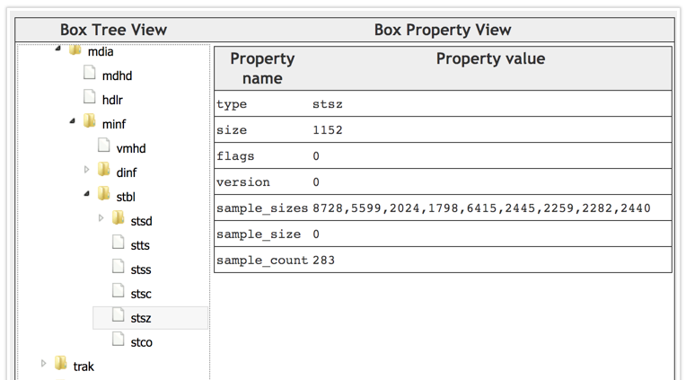

**stts(Decoding Time to Sample Box)**

stts包含dts到sample number的映射表，主要用来推导每个帧的时长

::

    aligned(8) class TimeToSampleBox extends FullBox(’stts’, version = 0, 0) {
        //stts中包含的entry条目数
        unsigned int(32)  entry_count;
        int i;
        for (i=0; i < entry_count; i++) {
            unsigned int(32)  sample_count;//单个entry中具有相同时长的连续sample的个数
            unsigned int(32)  sample_delta;//sample的时长(以timescale为计量)
        }
    }

实例

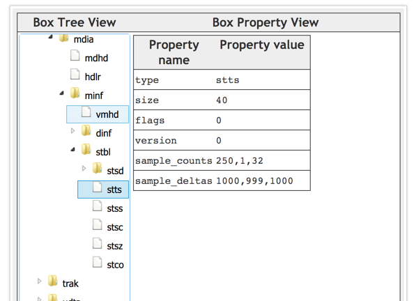

entry_count为3,前250个sample时长为1000,第251个sample时长为999,第252~283个sample的时长为1000

如果timesacle为1000,则实际时长需要除以1000

**stss(Sync Sample Box)**

mp4文件中，关键帧所在的sample的序号，如果没有stss的话，所有sample中都是关键帧

::

    aligned(8) class SyncSampleBox
       extends FullBox(‘stss’, version = 0, 0) {
       unsigned int(32)  entry_count;   //entry的条目数，可以认为是关键帧的数目
       int i;
       for (i=0; i < entry_count; i++) {
          unsigned int(32)  sample_number; //关键帧对应的sample序号(从1开始计算)
       }
    }

实例

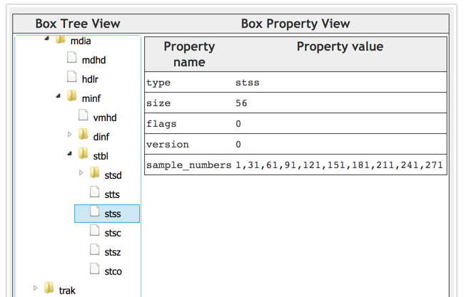

第1、31、61、91、121...271个sample是关键帧。

**ctts(Composition Time to Sample Box)**

从解码(dts)到渲染(pts)之间的差值. 对于只有I帧，P帧的视频来说，解码顺序，渲染顺序是一致的，此时ctts没必要存在．
对应存在B帧的视频来说，ctts就需要存在来，当pts, dts不像等时，就需要ctts了．公式为　CT(n) = DT(n) + CTTS(n)

::

    aligned(8) class CompositionOffsetBox extends FullBox(‘ctts’, version = 0, 0) { unsigned int(32) entry_count;
      int i;
       for (i=0; i < entry_count; i++) {
          unsigned int(32)  sample_count;
          unsigned int(32)  sample_offset;
       }
    }

示例

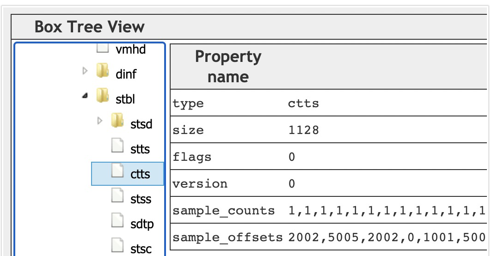

