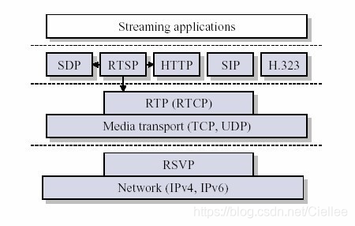
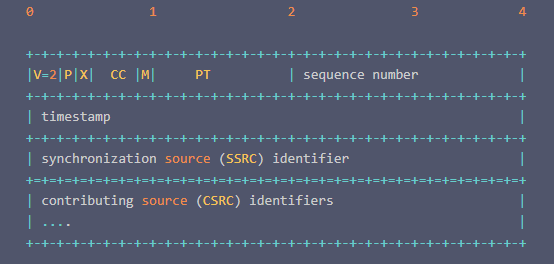
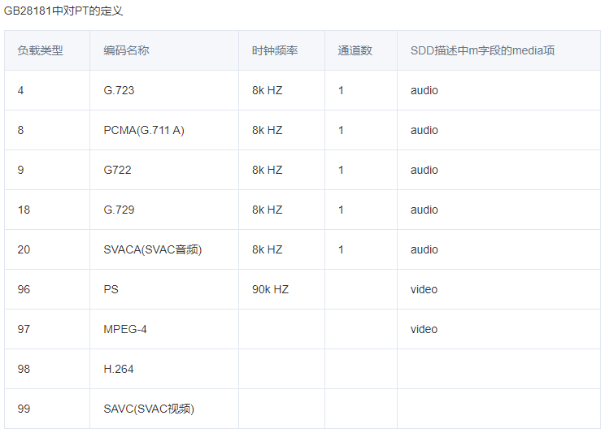
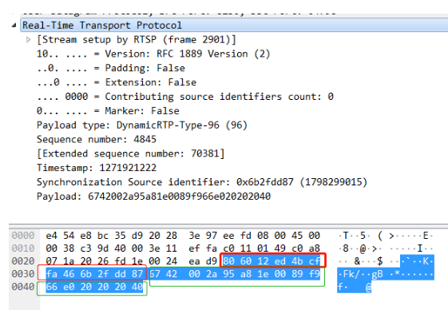
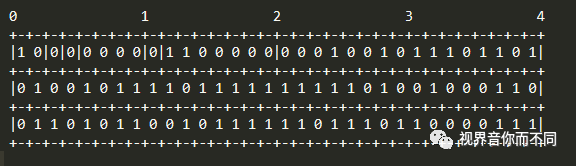

RTP协议
==========

RTP全名是 ``Real-time Transport Protocal`` (实时传输协议) 

RTP用来为网络中音视频实时传输的多媒体数据提供端到端的实时传输服务，包含时间信息和流同步，但不保证服务质量

RTP(实时传输协议)，顾名思义他是用来提供实时传输的，因而可以看成是传输层的一个子层．

可以认为RTP介于应用层和传输层之间．RTP实现者在发送RTP包时，需要将数据封装成RTP包

RTP格式
----------

RTP数据包由两部分组成，一部分是RTP Header, RTP Header占用最少12字节，最多72字节．另一部分是RTP Payload，用来封装实际的数据，例如H264码流

**RTP Header格式**

- 版本号(V): 2bit,用来标识使用的RTP版本

- 填充位(P): 1bit,如果该位置位，则该RTP包的尾部包含附加的填充字节

- 扩展为(X): 1bit,如果该位置位，则RTP固定头部后面就跟有一个扩展头部

- CSRC计数器(CC): 4bit,含有固定头部后面跟着的CSRC的数目

- 标记位(M): 1bit,该位置位时，表示该数据包是一帧数据的最后一个数据包

- 载荷类型(PT): 7bit, 标识了RTP负载的类型

- 序列号(SN): 16bit,发送方在每发送完一个RTP包后就将该域的值增加一，接收方可以由该域检测包的丢失．

- 时间戳(timestamp): 32bit,记录该包中第一个字节的采样时刻,时间戳是去除抖动和实现同步不可缺少的
  
- 同步源标识符(SSRC): 32bit,同步源是指RTP包流的来源，在同一个RTP会话中不能有两个相同的SSRC值．该标识符是随机值．

- 贡献源列表(CSRC List): 0~15项，每项32bit,用来标志对一个RTP混合器产生的新包有贡献的所有RTP包的源

RTP实例
----------

根据PT类型的不同，Payload有不同的组织方式.以下是一个实际的RTP数据包的抓包

**红色框中的部分为RTP Header,绿色框中的为RTP Payload**

将RTP Header部分用16进制表示，如下

