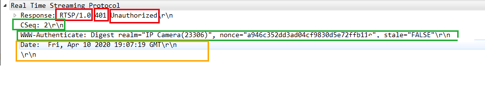

RTSP协议
============

RTSP全称 ``Real Time Streaming Protocal`` ,RTSP位于RTP和RTCP之上(RTCP用于控制传输，RTP用于数据传输),使用TCP或UDP完成数据传输

RTSP消息格式
--------------

RTSP消息分为两大类，请求消息(Request)以及回应消息(Response)

- 请求消息格式

.. image::
    res/rtsp_request_struct.png

.. note::
    - 请求消息由方法+URI+RTSP版本开头，之后跟一条或多条消息．
    - URI: 表示接收方的地址，如rtsp://192.168.1.5:8888
    - CR: 表示回车
    - LF: 表示换行
    - 最后一条消息要使用两个CR LF

- 抓包实例

- 响应消息格式

回应消息有RTSP版本+状态码+解释开头，之后跟一条或者多条消息

- 状态码: 表示状态，同http的返回状态，如200,表示OK
- 解释: 针对状态码的文本解释
- 最后一条消息需要两个回车和换行

RTSP基本交互过程
-------------------

.. image::
    res/rtsp_process.png

- OPTIONS
    - C--->S 客户端向服务器端发送OPTIONS,请求可用的方法
    - S--->C 服务器端回复客户端，消息中包含当前可用的方法

- DESRIBE
    - C--->S 客户端向服务器端请求媒体描述文件，一般通过rtsp开头的url来发起请求，格式为sdp
    - S--->C 服务器回复客户端sdp文件，该文件告诉客户端服务器有哪些音视频流，有什么属性，如编解码器信息，帧率等

- SETUP
    - C--->S 客户端向服务器端发起建立连接请求，请求建立会话连接，准备开始接收音视频数据，请求信息描述来期望音视频数据包基于UDP还是TCP传输，指定了RTP,RTCP端口，以及单播还是组播等信息
    - S--->C 服务器端收到客户端的请求后，根据客户端请求的端口号确定发送控制数据的端口以及音视频数据的端口

- PLAY
    - C--->S 客户端向服务器端请求播放媒体
    - S--->C 服务器端恢复客户端200 OK!，之后开始通过SETUP中指定的端口开始发送数据

- TEARDOWN
    - C--->S 结束播放的时候，客户端向服务器端发起结束请求
    - S--->C 服务器端收到消息后，向客户端发送200 OK,之后断开连接

RTSP抓包实例
^^^^^^^^^^^^^^

RTSP方法
----------

OPTION
^^^^^^^

OPTIONS一般为RTSP客户端发起的第一条请求指令，该指令的目的是得到服务端提供了哪些方法

- OPTION请求消息格式

- OPTION应答消息格式

- RTSP OPTIONS请求

::

    OPTIONS rtsp://192.17.1.63:554 RTSP/1.0\r\n
    CSeq: 1\r\n
    User-Agent: Lavf58.42.100\r\

- RTSP OPTIONS应答

::

    RTSP/1.0 200 OK\r\n
    CSeq: 1\r\n
    Public: OPTIONS, DESCRIBE, PLAY, PAUSE, SETUP, TEARDOWN, SET_PARAMETER, GET_PARAMETER\r\n
    Date:  Fri, Apr 10 2020 19:07:19 GMT\r\n

DESCRIBE
^^^^^^^^^^^^^^^

客户端在发送OPTION请求之后，客户端会继续向服务器发送DESCRIBE消息，来获取会话描述信息(sdp).

- DESCRIBE请求格式

.. note::
    Accept: 指明接收数据的格式，如application/sdp表示接收sdp信息

对于DESCRIBE消息，服务端的回复有两种可能，如果需要认证，则首先返回401,并要求客户端认证，客户端再次发送包含认证信息的DESCRIBE指令，服务端收到带
认证信息的DESCRIBE请求，返回sdp信息给客户端．如果不需要认证，则直接返回sdp

- 需要认证的情况

1. 服务端发送回复消息，状态为401,状态描述符为Unauhtorized(未认证)，发回WWW-Authenticate消息，告诉客户端认证所需信息

2. 客户端收到该消息之后，需要再次向服务器发送DESCRIBE请求，这一次消息体要增加Authorization字段

服务端收到带认证信息的DESCRIBE请求之后，如果信息正确，则会回复200 ok的消息，同时返回sdp信息

.. note::
    - 返回的状态码为200，状态描述为OK，包序列号与DESCRIBE请求的序列号相同，表示对该请求的回复
    - Content-type: 表示回复内容类型，置位application/sdp
    - Content-Base: 一般用RTSP URI表示
    - Content-length: 表示返回的sdp信息的长度

第一次DESCRIBE请求

::

    DESCRIBE rtsp://192.17.1.63:554 RTSP/1.0
    Accept: application/sdp
    CSeq: 2
    User-Agent: Lavf58.42.100

服务端回复的401消息

::

    RTSP/1.0 401 Unauthorized
    CSeq: 2
    WWW-Authenticate: Digest realm="IP Camera(23306)", nonce="a946c352dd3ad04cf9830d5e72ffb11e", stale="FALSE"
    Date: Fri, Apr 10 2020 19:07:19 GMT

第二次DESCRIBE请求

::

    DESCRIBE rtsp://192.17.1.63:554 RTSP/1.0
    Accept: application/sdp
    CSeq: 3
    User-Agent: Lavf58.42.100
    Authorization: Digest username="admin", realm="IP Camera(23306)", nonce="a946c352dd3ad04cf9830d5e72ffb11e", uri="rtsp://192.17.1.63:554", response="8f1987b6da1aeb3f3744e1307d850281"

验证OK消息

::

    RTSP/1.0 200 OK
    CSeq: 3
    Content-Type: application/sdp
    Content-Base: rtsp://192.17.1.63:554/
    Content-Length: 712

    v=0
    o=- 1586545639954157 1586545639954157 IN IP4 192.17.1.63
    s=Media Presentation
    e=NONE
    b=AS:5100
    t=0 0
    a=control:rtsp://192.17.1.63:554/
    m=video 0 RTP/AVP 96
    c=IN IP4 0.0.0.0
    b=AS:5000
    a=recvonly
    a=x-dimensions:1920,1080
    a=control:rtsp://192.17.1.63:554/trackID=1
    a=rtpmap:96 H264/90000
    a=fmtp:96 profile-level-id=420029; packetization-mode=1; sprop-parameter-sets=Z01AKI2NQDwBE/LgLcBAQFAAAD6AAAw1DoYACYFAABfXgu8uNDAATAoAAL68F3lwoA==,aO44gA==
    m=audio 0 RTP/AVP 8
    c=IN IP4 0.0.0.0
    b=AS:50
    a=recvonly
    a=control:rtsp://192.17.1.63:554/trackID=2
    a=rtpmap:8 PCMA/8000
    a=Media_header:MEDIAINFO=494D4B48010300000400000111710110401F000000FA000000000000000000000000000000000000;
    a=appversion:1.0

SETUP
^^^^^^^

SETUP请求的作用是指明媒体流应该以什么方式传输，每个流PLAY之前必须执行SETUP．发送SETUP请求时，客户端会指定两个端口，一个端口用于接收RTP数据．另一个端口接收RTCP数据，
偶数端口用来接收RTP数据，相邻的奇数端口用于接收RTCP数据

SETUP请求消息格式

- TRANSPORT: 表明媒体流的传输方式，具体包括传输协议如RTP/UDP.指出是单播，组播还是广播．声明两个端口

- Session: 标识会话ID

- Authorization: 标识认证信息

SETUP回应消息格式

如果没有异常情况，RTSP服务器的回复比较简单，回复200 OK消息．同时在Transport字段中增加sever_port,指明对等的服务端RTP和RTCP传输的端口．增加ssrc字段，增加
mode字段，同时返回一个session id,用于标识本次会话连接，之后客户端发起PLAY请求的时候需要使用该字段

request

::

    SETUP rtsp://192.17.1.63:554/trackID=1 RTSP/1.0
    Transport: RTP/AVP/UDP;unicast;client_port=26968-26969
    CSeq: 4
    User-Agent: Lavf58.42.100
    Authorization: Digest username="admin", realm="IP Camera(23306)", nonce="a946c352dd3ad04cf9830d5e72ffb11e", uri="rtsp://192.17.1.63:554/trackID=1", response="e29ca030062df6022faa77fefde40b28"

response

::

    RTSP/1.0 200 OK\r\n
    CSeq: 4\r\n
    Session: 337474243;timeout=60\r\n
    Transport: RTP/AVP/UDP;unicast;client_port=26968-26969;server_port=8284-8285;ssrc=4a7fb757;mode="play"\r\n
    Date: Fri, Apr 10 2020 19:07:19 GMT\r\n
    \r\n

PLAY
^^^^^^

PLAY消息是客户端发送的播放请求，发送播放请求的时候可以指定播放区间．发起播放请求后，如果连接正常，则服务端开始播放，即开始向客户端按照之前在
TRANSPORT中约定好的方式发送音视频数据包

.. note::
    Range: 是PLAY消息特有的，代表请求播放的时间段，使用ntp时间来表示

PLAY回复消息格式

RTSP PLAY(request)

::

    PLAY rtsp://192.17.1.63:554/ RTSP/1.0\r\n
    Range: npt=0.000-\r\n
    CSeq: 6\r\n
    User-Agent: Lavf58.42.100\r\n
    Session: 337474243\r\n
    Authorization: Digest username="admin", realm="IP Camera(23306)", nonce="a946c352dd3ad04cf9830d5e72ffb11e", uri="rtsp://192.17.1.63:554/", response="9ea6c2659d3bce8d129ca3549ecc7fbf"\r\n\r\n

RTSP PLAY(response)

::

    RTSP/1.0 200 OK\r\n
    CSeq: 6\r\n
    Session: 337474243\r\n
    RTP-Info: url=rtsp://192.17.1.63:554/trackID=1;seq=3658;rtptime=1710363406,url=rtsp://192.17.1.63:554/trackID=2;seq=6598;rtptime=4065225152\r\n
    Date: Fri, Apr 10 2020 19:07:20 GMT\r\n\r\n

PAUSE
^^^^^^^

暂停请求会使得流传输暂时中断(相当于暂停),如果请求的URI指向一个流地址，则仅针对该流的回放和录制会被中断

PAUSE请求格式

PAUSE回应格式

.. image::
    res/pause_res_struct.png

::

    PAUSE rtsp://example.com/fizzle/foo RTSP/1.0\r\n
    CSeq：834\r\n
    Session：12345678\r\n\r\n

::

    RTSP/1.0  200 OK\r\n
    CSeq:834\r\n
    Session：12345678\r\n\r\n

TEARDOWN
^^^^^^^^^^

TEARDOWN是拆卸的意思，对于RTSP而言，就是结束流传输，同时释放与之相关的资源，TEARDOWN之后，整个RTSP连接也就结束了．

- TEARDOWN请求消息格式

::

    TEARDOWN rtsp://192.17.1.73:554/Streaming/Channels/101/?transportmode=unicast&profile=Profile_1 RTSP/1.0\r\n
    CSeq: 10\r\n
    Authorization: Digest username="admin", realm="bcad28138995", nonce="a1a5b9d3865180dccbaffb1cb2eb2a27", uri="rtsp://192.17.1.73:554/Streaming/Channels/101/", response="c5c005ef16638dfa326dcfc0c3f54aab"\r\n
    User-Agent: LibVLC/3.0.11 (LIVE555 Streaming Media v2016.11.28)\r\n
    Session: 1659421772\r\n\r\n

- TEARDOWN回应消息格式

::

    RTSP/1.0 200 OK\r\n
    CSeq: 10\r\n
    Session: 1659421772\r\n
    Date: Thu, Aug 27 2020 18:31:13 GMT\r\n\r\n

GET_PARAMETER
^^^^^^^^^^^^^^^

GET_PARAMETER用来向服务器获取参数，一般用于获取时间范围．当发送的请求中没有相关请求参数时，则用作保持RTSP连接

- GET PARAMETER请求消息格式

.. image::
    res/get_req_struct.png

::

    GET_PARAMETER rtsp://192.17.1.73:554/Streaming/Channels/101/?transportmode=unicast&profile=Profile_1 RTSP/1.0\r\n
    CSeq: 7\r\n
    Authorization: Digest username="admin", realm="bcad28138995", nonce="a1a5b9d3865180dccbaffb1cb2eb2a27", uri="rtsp://192.17.1.73:554/Streaming/Channels/101/", response="4764a1f2772821f5528ebbb2ad18c3f9"\r\n
    User-Agent: LibVLC/3.0.11 (LIVE555 Streaming Media v2016.11.28)\r\n
    Session: 1659421772\r\n\r\n

- GET PARAMETER回应消息格式

::

    RTSP/1.0 200 OK\r\n
    CSeq: 7\r\n
    Date: Thu, Aug 27 2020 18:29:00 GMT\r\n

SET_PARAMETER
^^^^^^^^^^^^^^^^^^^^

SET_PARAMETER方法用于给URI指定的流地址设置参数

- SET_PARAMETER请求消息格式

- SET_PARAMETER回应消息格式

